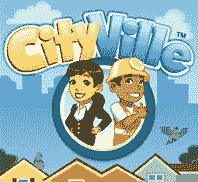
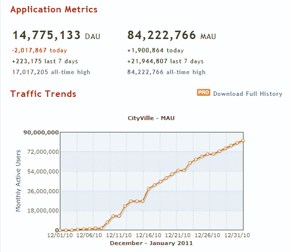

# CityVille 会成为第一个月活跃用户突破 1 亿的公司吗？TechCrunch

> 原文：<https://web.archive.org/web/http://techcrunch.com/2011/01/03/will-cityville-be-first-to-blow-past-100-million-monthly-active-users/?utm_source=feedburner&utm_medium=feed&utm_campaign=Feed%3A+Techcrunch+(TechCrunch>&utm_content=Google+Feedfetcher)

# CityVille 会成为第一个月活跃用户突破 1 亿的公司吗？

一个多月前，Zynga 在脸书推出了 CityVille，根据应用页面显示，现在有超过 [84，222，766 名用户](https://web.archive.org/web/20230202230010/http://www.facebook.com/apps/application.php?id=291549705119)在积极玩这个游戏。

客观地说，Zynga 的另一款热门游戏 FarmVille 每月有大约 5800 万活跃用户。因此，CityVille 以显著优势成为脸书平台上有史以来最大的应用。这款游戏仅今天就吸引了近 200 万新玩家，在过去 7 天里吸引了近 2200 万。

请看下面这条漂亮的小曲线，这是由 AppData 提供的。

正如社交游戏内部人士指出的那样，FarmVille 在 2010 年 3 月拥有 8376 万玩家，是当时该平台上任何应用程序的最高记录(当时的规则略有不同)。现在这个记录被打破了。

ISG 还预测，未来 CityVille 的月活跃用户将达到 1.25 亿。

尽管在不久的将来，增长肯定会在某个时候趋于平稳，但在我看来，这实际上是一个相对保守的预测。从数据来看，CityVille 似乎将在未来两周左右成为第一个月活跃用户突破 1 亿的应用/游戏。

