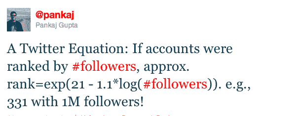

# Twitter 数学:如果账户按关注者排名，这将是等式 TechCrunch

> 原文：<https://web.archive.org/web/http://techcrunch.com/2011/01/04/twitter-ranking-equation/?utm_source=feedburner&utm_medium=feed&utm_campaign=Feed%3A+Techcrunch+(TechCrunch>&utm_content=Google+Reader)

# Twitter 数学:如果账户按关注者排名，这将是等式

**exp(21–1.1 * log(追随者数量))**

如果你想知道你在 Twitter 用户中拥有多少粉丝，这就是方程式。对你们大多数人来说。Twitter 技术负责人 Pankaj Gupta [今天早些时候在 Twitter 上向](https://web.archive.org/web/20230202231154/http://twitter.com/#!/pankaj/status/22376043037851649)发布了这个等式。

> 一个 Twitter 等式:如果账户按关注人数排名，大约。rank = exp(21–1.1 * log(追随者数量))。比如有 100 万粉丝的 331！

果不其然，exp(21–1.1 * log(1，000，000)) = 331.272，如果我的数学没错的话。我说的“我的”数学，当然是指 WolframAlpha 的数学。

需要注意的是，只有当你有 100 到 100 万推特粉丝时，这个等式才成立。“令人惊讶的是，看似复杂的系统在内部不过是方程式，”他指出。

但由于这个范围涵盖了绝大多数 Twitter 用户，这对于了解你的立场应该是有用的。

将我自己的[数字(31，074 名关注者)代入等式，我在这个系统中的排名约为 15，085。拥有 58，722 名关注者的 Mike](https://web.archive.org/web/20230202231154/http://twitter.com/#!/parislemon) 将排在 7，490 名左右。Scoble 有 156，709 名粉丝，大概有 2，544 人。

所有这些都特别有趣，因为我们知道 Twitter 为每个用户都有一个秘密的“声誉排名”分数。这是 Twitter 将来可能会公开的事情。但是这个等式显然与此无关。*“我应该补充一点，这不是我们对 twitter 用户在内部做的任何有趣的事情进行排名的方式*，”古普塔告诉我们。

我还是更喜欢用[我的推特黄金比例](https://web.archive.org/web/20230202231154/https://techcrunch.com/2009/08/26/twitters-golden-ratio-that-no-one-likes-to-talk-about/)。

此外，如果我的数学是正确的(这里的“数学”是指演绎技巧)。这意味着 Twitter 大约有 331 名用户，拥有超过 100 万的粉丝。