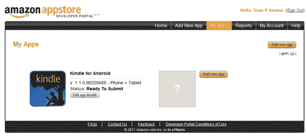
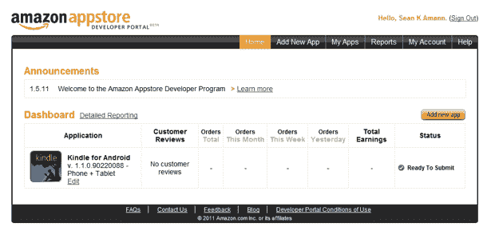

# 亚马逊颠覆性的 Android 应用商店现已向开发者开放——详细信息 TechCrunch

> 原文：<https://web.archive.org/web/https://techcrunch.com/2011/01/05/amazon-android-app-store-2/>

碎片化。策展。建议。挑一个吧:Android 得到了这三者，这是对今年晚些时候将推出的一个新的亚马逊运营的应用程序市场的称赞。今天，亚马逊已经推出了商店面向开发者的部分，邀请开发者提交他们的应用程序，以便他们在今年晚些时候 app store 面向消费者推出时做好准备(亚马逊没有给出全面推出的确切日期)。开发者门户在 http://developer.amazon.com[的](https://web.archive.org/web/20221225162236/http://developer.amazon.com/)。

我们[早在九月份就报道过](https://web.archive.org/web/20221225162236/https://techcrunch.com/2010/09/27/amazon-android-app-store/)即将到来的新闻，所以这并不令人惊讶。但它将为 Android 应用程序的购买和分发方式带来一些非常有趣的动态。从某种意义上来说，这是苹果应用商店的安卓版——甚至比谷歌的官方安卓市场还要多。

我与亚马逊移动服务品类负责人 Aaron Rubenson 和移动服务工程部门总经理 Ameesh Paleja 谈论了这家新店，它显然有可能成为一笔大交易。

首先，为那些不太关注 Android 的人提供一些背景信息。所有谷歌支持的安卓设备都配有安卓市场，以及一套谷歌开发的应用程序，如 Gmail。Android Market 很像苹果的应用商店，但有几个关键区别:它没有审批系统，因此开发者可以快速提交和迭代他们的应用程序。它还倾向于拥有许多苹果会拒绝的垃圾应用程序——在某些设备上启动时崩溃的东西，或者偶尔具有不按预期工作的功能的应用程序。虽然谷歌的条款确实要求描述准确，但普遍的态度是让市场决定什么是有效的，它会让评级最高的应用程序浮出水面(大部分时间)，同时让垃圾程序沉入海底。

亚马逊正在采取一种更符合苹果的方式。希望出现在亚马逊商店的开发者必须获得批准(亚马逊表示，这个过程目前需要大约一周时间)。亚马逊将有更严格的指导方针:你的应用程序必须正常工作(也就是说，它不能马上崩溃),它必须做你所说的事情。它还必须安全。Android Market 有许多相同的要求，但这里的不同之处在于，亚马逊在应用程序部署到其商店之前会对其进行检查，而谷歌是在有问题的应用程序被报告后才会这样做。

然而，与苹果的筛选政策(多年来一直是个谜，至今仍很模糊)不同，亚马逊表示，就商店允许的内容而言，它将采取更自由的立场。色情和非法应用是不允许的，但你的讽刺应用应该没问题。开发人员不必对他们的。apk 文件也是——听起来你可以把同样的文件上传到谷歌和亚马逊的市场上(两者都没有排他性要求)。

与我们已经习惯的移动应用商店最大的不同在于定价。与苹果的应用商店和安卓市场不同，开发者可以根据自己的喜好设定价格，亚马逊保留了对应用定价的完全控制权。设置有点混乱:在提交你的申请时，你可以设置一个“标价”，这是你通常出售它的价格。亚马逊会用各种市场因素来决定它想要用什么价格，你得到每笔销售收入的 70%(这是行业标准)。如果亚马逊对你的应用程序大幅打折，或者免费提供，你肯定会得到标价的 20%。

这里的底线是，亚马逊将对一些应用程序提供折扣(可能会比 Android Market 或其他地方的相同应用程序便宜得多)。这听起来可能会让一些开发商感到沮丧，但鲁本森和帕莱贾说，他们将尽一切努力最大限度地增加开发商的收入，有时这需要调整定价。他们还表示，亚马逊有让开发者开心的动机——开发者可以提前 10 天通知将他们的应用从商店中移除。我们必须等着看这个系统是否有效。

那么，除了这些价格差异之外，消费者为什么还想使用亚马逊应用商店呢？这个问题有几个答案。

首先，一些制造 Android 设备的制造商决定不与谷歌合作，提供官方的谷歌应用套件(包括 Android Market)。亚马逊很乐意向这些制造商提供他们的商店，它可以在任何 1.6 或更高版本的 Android 设备上工作。因此，举例来说，如果脸书发布自己风格的 Android，他们可能会包括亚马逊的应用商店。

第二个原因:亚马逊表示，它可以利用 Amazon.com 现有的技术提供推荐。这包括显示彼此相似的应用程序这一明显的例子，但亚马逊也将寻找实体产品和应用程序之间的相关性——例如，它可能会开始向正在浏览棒球棒的人推荐一个流行的棒球应用程序。随着用户浏览 Amazon.com，它将推广这些应用。

亚马逊表示，现在谈论商店本身的样子还为时过早，但他们确实分享了一些关于消费者体验的细节。首先，不出所料，支付将使用亚马逊的一键式支付系统(已经有数千万张信用卡存档)完成，尽管开发者可以将他们想要的任何交易系统集成到应用程序本身。

客户将能够通过他们的手机或 Amazon.com 上的台式电脑浏览应用程序，他们还能够将购买的应用程序“发送”到他们的移动设备上。这听起来类似于谷歌[在谷歌 I/O 上展示的](https://web.archive.org/web/20221225162236/https://techcrunch.com/2010/05/20/live-blogging-the-second-google-io-keynote-the-day-of-android-and-google-tv/)，但有一个小警告:这些应用程序实际上不会立即被推送和安装，听起来好像你必须启动亚马逊应用程序才能做到这一点。

那么，人们将如何从他们的 Android 设备访问这个亚马逊市场呢？对于一些用户来说，这将证明有点棘手——亚马逊将提供一个指导用户如何做到这一点的演练，但它需要你深入到设备上的设置菜单，并允许从“未知来源”安装。如果你知道你在做什么，这很容易找到，但听起来有点可怕。然而，亚马逊也在与各种合作伙伴进行谈判，我们可能会看到大量预装应用程序上市。

现在，亚马逊并不是唯一一家提供另类安卓应用商店的公司——威瑞森也在做自己的应用商店，而且肯定会有更多的公司跟进。但是亚马逊有能力将自己打造成事实上的非谷歌应用商店——这可能被证明是非常重要的。正如凯文·马克斯(Kevin Marks)[最近写的](https://web.archive.org/web/20221225162236/http://epeus.blogspot.com/2011/01/two-faces-of-android.html)(我们[进一步讨论了](https://web.archive.org/web/20221225162236/https://techcrunch.com/2011/01/04/facebookphone-twitterphone-verizonphone/))，Android 将越来越多地分裂成与谷歌联系不那么紧密的版本，我们将开始看到更多核心“谷歌应用程序”的替代版本。亚马逊的应用商店作为这个备选套件的一部分将非常合适。

这也将导致相同应用程序的价格之争(当应用程序分发被单一店面垄断时，这实际上是不可能的)。是的，这可能会导致一些用户困惑，尽管亚马逊有强烈的动机尽可能保持简单明了。

毫无疑问，这不会以任何方式取代谷歌的安卓市场。谷歌商店将在一段时间内获得更好的国际支持(亚马逊在推出时仅面向美国)，默认情况下，它仍将在许多手机上销售。但是考虑到在不久的将来会有多少 Android 设备出现(它们每天激活超过 300，000 个)，肯定会有足够多的顾客来维持不止一家商店的营业。

我问了几次消费者发布会的时间，但除了“今年”，我什么都不知道。然而，该团队确实说过，移动店面是在考虑平板电脑的情况下建立的，所以我的猜测是，我们可以预计这将在运行 Honeycomb 的 Android 平板电脑上市后推出(可能会在 4 月份左右或更晚)。

我问亚马逊团队，谷歌对这次发布有何感想——他们咯咯地笑了起来，说安卓正处于惊人的增长轨道，他们喜欢它的开放性。

记者就此置评时，谷歌给出了这样的声明:

> Android 是一个开放的平台——除了谷歌，其他实体可以自由创建自己的内容和市场，就像网络一样。

我打赌他们一定很激动。

