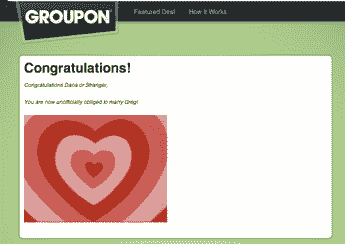
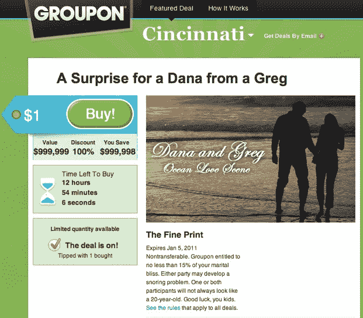

# 一生的交易:Groupon TechCrunch 上的第一次求婚

> 原文：<https://web.archive.org/web/http://techcrunch.com/2011/01/05/groupon-marriage/?utm_source=feedburner&utm_medium=feed&utm_campaign=Feed%3A+Techcrunch+(TechCrunch>&utm_content=Google+Reader)

# 一生的交易:Groupon 上的第一次求婚

这是迟早的事。一个真正无处不在的社会现象的标志是当有人用它向别人求婚。我们已经在[推特](https://web.archive.org/web/20230202225457/http://www.wired.com/underwire/2008/03/true-story-of-a/)、[脸书](https://web.archive.org/web/20230202225457/http://imgur.com/al6CL)和 [iPad](https://web.archive.org/web/20230202225457/https://techcrunch.com/2010/04/11/ipad-marriage-proposal-congrats-zach-you-dork/) 上看到了求婚。现在我们有了 Groupon 上的第一次求婚。

这是多么好的交易。辛辛那提一个叫格雷格的家伙提出要和一个叫黛娜的女人结婚，而且只花了她 1 美元(这笔交易的总价值是 999999 美元，我猜这是 Groupon 上允许的最高价格，但是你真的能给爱情定价吗？).看起来她买下它是因为“交易开始了”或者这可能是一个营销噱头——你永远不知道 Groupon 上那些爱开玩笑的人。

最棒的是，如果你点击购买按钮，你也可以和格雷格订婚。它会将您带到一个带有心形动画和消息的页面:

> 恭喜你，黛娜或陌生人，你现在非正式地必须嫁给格雷格了！

现在的孩子。只有面对面求婚时才会有的浪漫和紧张感都到哪里去了？

