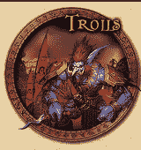

# 沃克数码就游戏专利起诉 Zynga、动视暴雪 TechCrunch

> 原文：<https://web.archive.org/web/http://techcrunch.com/2011/01/05/walker-digital-zynga-activision-and-blizzard/>

# 沃克数码就游戏专利起诉 Zynga、动视暴雪

[沃克数码](https://web.archive.org/web/20230202234737/http://www.walkerdigital.com/)，由[Priceline.com](https://web.archive.org/web/20230202234737/http://www.crunchbase.com/company/priceline)的共同发明人杰伊·s·沃克创立的“发明公司”，不仅仅是[起诉脸书](https://web.archive.org/web/20230202234737/https://techcrunch.com/2010/11/30/facebook-sued-for-having-privacy-controls-in-place-yes-seriously/)，他还试图挑战一些大型游戏发行商。

更具体地说，沃克数码刚刚[对](https://web.archive.org/web/20230202234737/http://news.priorsmart.com/walker-digital-v-activision-l3yR/) [Zynga](https://web.archive.org/web/20230202234737/http://www.crunchbase.com/company/zynga) 、[动视](https://web.archive.org/web/20230202234737/http://www.crunchbase.com/company/activision)以及后者的子公司[暴雪娱乐](https://web.archive.org/web/20230202234737/http://www.crunchbase.com/company/blizzard-entertainment)提起专利侵权诉讼。

从下面嵌入的诉状中可以看出，该诉讼专利是 2002 年 7 月 30 日授权的美国专利号 [6，425，828](https://web.archive.org/web/20230202234737/http://www.google.com/patents/about?id=8PsKAAAAEBAJ&dq=6,425,828) 。该专利名为“数据库驱动的在线分布式锦标赛系统”。

Walker Digital 认为，该游戏专利涉及一种用于多个玩家的分布式电子锦标赛的产品和方法，该产品和方法在玩家参加锦标赛的同时与中央控制器交换信息以影响游戏，并存储玩家信息以影响后续锦标赛中的游戏。

根据“发明公司”的说法，上述出版商的一系列游戏，包括 Zynga 的黑手党战争、Wolfenstein、使命召唤系列和魔兽世界等，都侵犯了这项专利。

因此上面的图像(这是一个[哇巨魔](https://web.archive.org/web/20230202234737/http://www.wowpedia.org/Troll))。

我们会关注这个案子的。