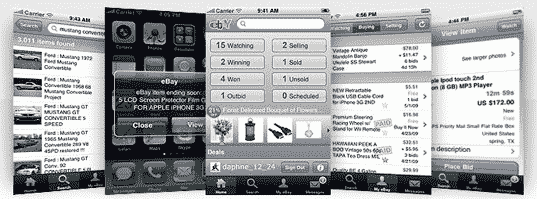

# 易贝:2010 年移动销售额从 6 亿美元增长到 20 亿美元 TechCrunch

> 原文：<https://web.archive.org/web/http://techcrunch.com/2011/01/06/ebay-mobile-sales-2010/?utm_source=feedburner&utm_medium=feed&utm_campaign=Feed%3A+Techcrunch+(TechCrunch>)

# 易贝:2010 年，手机销售额从 6 亿美元增长到 20 亿美元

[易贝](https://web.archive.org/web/20230202225836/http://www.crunchbase.com/company/ebay)宣布，2010 年全球移动销售额接近 20 亿美元，高于 2009 年的 6 亿美元。需要说明的是，我们这里说的不是收入，而是商品总量。然而，一个明显的迹象表明，移动电子商务已经达到了一个临界点。

易贝早些时候宣布，从 11 月 25 日到 12 月 25 日，全球销售额比去年同期增长了 166%[,达到 2 . 3 亿美元](https://web.archive.org/web/20230202225836/https://techcrunch.com/2010/12/29/ebays-gross-mobile-sales-for-the-holiday-season-up-166-percent-to-230-million/),所以假日季节显然是这一增长的催化剂。

这家电子商务公司表示，其移动应用程序让用户可以随时随地访问易贝的全球市场，在 190 多个国家以 8 种语言下载了 3000 多万次。

英国显然是最快采用移动商务的国家，通过易贝应用购物的英国人比欧洲其他任何地方都多。该公司补充说，在英国，平均每两秒钟就有一件商品通过易贝买家应用程序被购买。

2010 年，德国和英国创造了易贝近三分之一的手机销量。

易贝分享的其他趣闻:

–每分钟就有 13 件衣服、一双鞋和配饰通过易贝在全球的移动应用售出

–通过易贝在全球的移动应用程序，每分钟有 94 次出价

–自 2008 年发布以来，已有超过 1500 万人下载了易贝的 iPhone 应用

易贝也有适用于安卓、黑莓和 Windows Phone 7 设备的应用。

易贝欧洲副总裁 Clare Gilmartin 完美地捕捉到了我对这个问题的想法:

> “令人震惊的是，价值 20 亿美元的销售额是通过一个几年前还不存在的平台和一台三年前还不存在的设备产生的。”