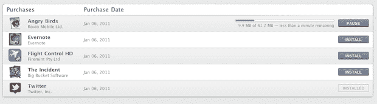
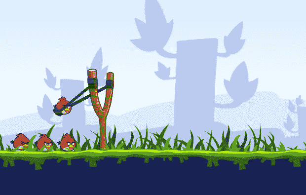
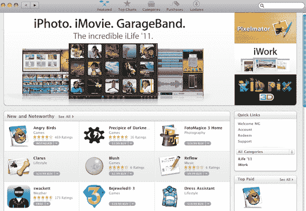

# Mac App Store 提供了 OS X 雄狮的味道和平台的未来 TechCrunch

> 原文：<https://web.archive.org/web/http://techcrunch.com/2011/01/06/mac-app-store-review/>

苹果应用商店将会非常庞大。当然，你现在看着它，会发现里面充斥着很多你不想要也永远不会想要的应用程序。但是在第一天已经有相当多的宝石(即一些关键游戏)。它如何工作的顺利执行非常清楚地表明，这是 Mac 平台软件分发的未来。其中一些应用本身也预示着平台的未来。

苹果将 Mac 应用商店直接植入 OS X，而不是让它成为一个独立的应用，这并非偶然。苹果显然意味着每个 Mac 用户最终都会拥有它。在某种程度上，你几乎可以认为这是 OS X 狮子的第一个功能，我们只是提前几个月得到它。为什么不呢？如果苹果意识到他们可以让它与 OS X 雪豹一起工作，为什么要强迫所有用户升级才能使用它呢？

苹果将继续从他们的苹果商店出售软件，但是选择会随着时间的推移而减少(T2)。它将从苹果制造的应用程序开始——关键部分在第一天就在 Mac 应用程序商店中。其他巨无霸应用发行商最终也会加入进来，因为他们无法拒绝这种新的内置分销渠道。

但是这里有更深层次的东西。看看现在最流行的两个应用:Mac 版 Twitter(免费)和愤怒的小鸟(付费)。Twitter 看起来更像一个 iPad 应用程序，而不是 Mac 应用程序。大多数 Mac 应用程序仍然使用的过时的“Aqua”用户界面已经一去不复返了。它已经被一个时尚的黑灰色用户界面所取代。它看起来有点像人们最初认为的新的“[大理石](https://web.archive.org/web/20230202234705/http://www.appleinsider.com/articles/09/03/25/apple_close_to_unveiling_guarded_snow_leopard_ui_overhaul.html)界面可能的样子。

浅蓝色滚动条不见了。相反，Twitter 有一个浅灰色的滚动条，似乎融入了应用程序的侧面。它看起来有点像最新版本的 iPhoto 和 QuickTime。这可能不是意外。这应该更接近从 Lion 开始的更多 OS X 应用程序的外观。至少我希望是这样——看起来很棒。

《愤怒的小鸟》指出了一点不同的东西。你打开应用程序，你别无选择，只能全屏。这是另一个功能，在 OS X 狮子，全屏应用程序吹捧。这是苹果从 iPad 上的应用程序中学到的，也是借鉴的。窗户被关上了——或者更确切地说，完全打开了。

这种全屏体验让您可以通过触摸更轻松地导航应用程序。是的，你可以用鼠标玩游戏，但如果你有一个 Magic Trackpad(或 MacBook trackpad)，这将是一个更好、更无缝的体验。这就像一个更大版本的 iPhone/iPad 游戏。

你滑动手指把鸟拉回来，然后放手开火。要调出菜单，你需要向下滑动三个手指。要放大或缩小，您需要挤压。要向右或向左移动视图，您需要使用两个手指。通过这样的应用程序，我们看到了在桌面上触摸的转变正在我们眼前发生。它不再是点击式的，而是轻击式的。

愤怒的小鸟并不孤单。其他 iOS 优先的应用程序，如飞行控制，也使用 Magic Trackpad，如果你有一个触摸体验的话。或者，如果你有一台 MacBook，你可以在上面安装触控板。

这些是[新型应用](https://web.archive.org/web/20230202234705/https://techcrunch.com/2010/10/24/mac-app-store/)，我怀疑我们可能会在 Mac 应用商店看到。它们首先是 iOS 的应用，但现在正在向 Mac 转移。它们是一种围绕触摸体验构建的微型应用程序，在触控板和虚拟光标的帮助下移植到 Mac 上。游戏是第一个来的，但还会有其他的。而且会有很多新的混血儿。

在过去的几个小时里，我一直在使用苹果应用商店，我的总体想法是:苹果为什么没有早点这么做？你点击下载一个 app 就搞定了。不需要复杂的安装。你可以跳到另一台机器上，重新下载你已经购买的任何应用程序。更新都是集中的。我今天花在应用上的钱可能比过去一年的总和还要多。

现在想象一下当应用变得非常好的时候。当我所说的一些混合动力车开始上市时。是的，苹果应用商店将会非常大。

