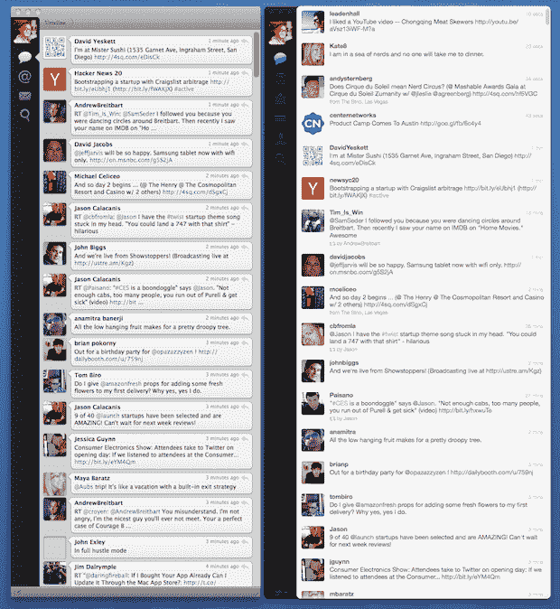

# Mac 版 Twitter 就像大型多人即时通讯——它会改变 Twitter 本身吗？TechCrunch

> 原文：<https://web.archive.org/web/https://techcrunch.com/2011/01/06/twitter-for-mac/>

早在 8 月份，我第一次通过用户流功能试用了 Twitter 流媒体 API，当时正在流行的第三方客户端 TweetDeck 上对新版本进行 beta 测试。“ [Twitter 用户流是实时网虫](https://web.archive.org/web/20230202225616/https://techcrunch.com/2010/08/02/realtime-twitter/)的克星，”这是我的标题。对于这篇文章，我有点想用标题“如果用户流是裂缝，那么 Mac 版 Twitter 就是裂缝管道。”后来我改变了主意。其实我没有。我只是现在提一下，而不是在标题中，因为我认为我用的标题更符合我实际想说的。

但事实是，新推出的 Mac 版 Twitter 是我见过的最令人上瘾、也是最吸引人的产品之一。仅仅看着它实时更新就足够令人着迷了。但当你真正开始与人交谈，并能看到他们实时回复你时，它就变得更像一种即时通讯服务，而不是我们通常看待 Twitter 的方式:静态的一次性消息，可能会在这里或那里回复。我想知道现在 Twitter 是否已经将实时用户流添加到官方产品中，这是否不会从根本上改变 Twitter 本身？

今天早上发布后不久，Erick 给了 Mac 版 Twitter 一个响亮的“ [meh](https://web.archive.org/web/20230202225616/https://techcrunch.com/2011/01/06/twitter-mac-stripped-down-meh/) ”。但埃里克是个推特迷。尽管我很喜欢 TweetDeck 打开用户流的想法，但我无法进入其中。对我来说，有太多的 UI 看起来像是一场噩梦(黑色背景)。虽然你可以定制它，但它的设计方式是尽可能地在你面前灌输尽可能多的信息。这不是我喜欢的。但是 Mac 版的 Twitter 很漂亮。它简单、快速、高度可用。

在我今天使用的第一天，我注意到我的推文行为发生了一些变化——从我今天交谈过的其他人那里，我并不孤单。现在，当我发微博时，由于用户流，我可以立即看到回复。这甚至比在 Twitter 的网站上要快得多，因为他们会阻止你点击一个按钮来刷新。随着所有这些推文实时向我涌来，我感到比平时更快回应的冲动。这导致了在 Twitter 上的实时对话——这就是为什么我把它比作 IM。

当然，对于那些不在对话中关注我所回复的人的人来说，这一定很烦人。但也很有意思。这就像在一个拥挤的房间里谈话，任何人都可以随时停下来听你说话。他们为什么要这么做？我不知道。为什么有人想在 Twitter 上关注其他人？

显然这以前也是个问题，但从来没有像现在这样。从我今天遇到的几个人和我谈论过的其他人来看，实时性极大地促进了对话。

再说一次，它会上瘾。在公共论坛上与朋友实时对话，我觉得有点奇怪，但管它呢，为什么不呢？挺好玩的。也许有人真的对被动倾听感兴趣，并随心所欲地加入进来。也许我疯了，这是一个奇怪的边缘案例，但我真的想知道实时用户流的实现是否会改变人们使用 Twitter 的方式。如果它变得更吵(我不一定是指坏的方面，只是不同的方面)怎么办？这是毁了 Twitter 还是让它更容易上瘾？

显然，在 Mac 上使用 Twitter 的人将会是更大受众中的一小部分。但它现在仍然是官方产品。如果 Twitter 在其网站上推出实时功能会怎样？这种类型的实时系统曾经导致 FriendFeed 上的巨大参与，FriendFeed 是一种比 Twitter 少几千万用户的服务。结果可能相当可怕(同样，可能是好的方面，也可能是坏的方面)。

无论如何，我喜欢这个最新版本的 Tweetie 重生为 Mac 版 Twitter。回到裂缝管道。

*下图:旧的和新的 Mac 版推特:*

