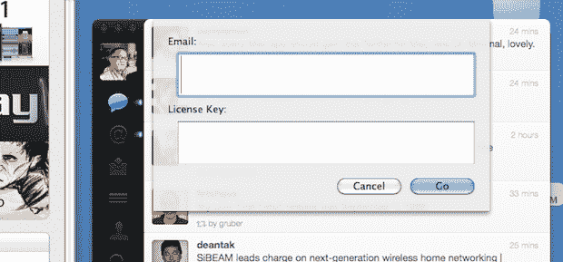
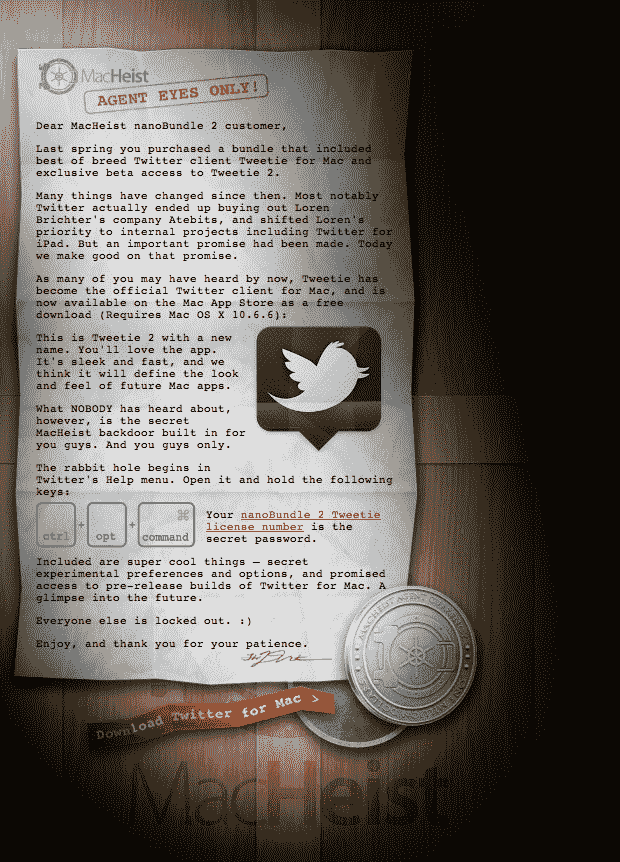

# Mac 版 Twitter 附带了一个秘密后门，以感谢 MacHeist 的忠诚者 TechCrunch

> 原文：<https://web.archive.org/web/http://techcrunch.com/2011/01/06/twitter-for-mac-secret-macheist/>

# Mac 的 Twitter 附带了一个秘密后门来感谢 MacHeist 的忠诚者

正如我们[昨天在](https://web.archive.org/web/20230202225702/https://techcrunch.com/2011/01/05/confirmed-tweetie-2-for-mac/)证实的那样，Tweetie 2 for Mac(又名 Twitter for Mac)今天发布的消息是真的。Erick 似乎不太喜欢这个应用程序，但他也是一个 TweetDeck 迷。我的第一反应是，它就像最初的 Mac 版 Tweetie，但是更快更干净。换句话说，我爱它到目前为止。但是还有别的。app 的一个小秘密，有个背景故事。

那些密切关注 Tweetie 2 for Mac news 的人会记得，当 Twitter [收购了该产品及其开发者 Loren Brichter](https://web.archive.org/web/20230202225702/https://techcrunch.com/2010/04/09/twitter-acquires-tweetie/)时，该应用还在开发中。他们的主要目标是为 iPhone 提供 Tweetie，他们很快就把它变成了 iPhone 的 Twitter。但是，当几个月后 iPad 版 Twitter 发布时，粉丝们感到失望，他们说没有计划对 Mac 版 Tweetie 产品做任何事情。有一组用户对此特别不满: [MacHeist](https://web.archive.org/web/20230202225702/http://www.macheist.com/) 用户。

原因是，作为去年 MacHeist nanoBundle 2 的一部分，他们承诺独家首发 Mac 版 Tweetie 2 的初始版本。但是，Twitter 的交易再次改变了这一点。直到今天。

MacHeist 正在向购买了该捆绑包的人发送一条消息，让他们知道他们正在兑现自己的承诺。虽然这款应用显然是面向所有人的，但它内置了一个秘密后门，只面向 MacHeist 用户。要进入该区域，您需要一个来自 MacHeist 的有效名称/许可证组合。如果你有了这些，你就能接触到"*超级酷的东西——秘密的实验性偏好和选项，并承诺获得 Mac 版 Twitter 的预发布版本。未来一瞥*，”马切斯特承诺道。

