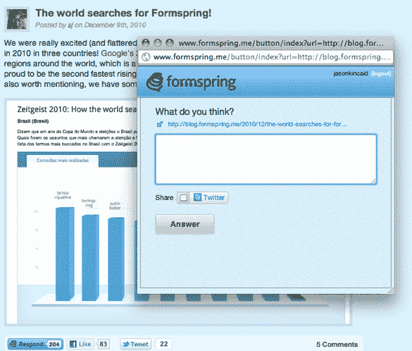

# Formspring 完成 1150 万美元的融资，启动“响应”按钮 TechCrunch

> 原文：<https://web.archive.org/web/http://techcrunch.com/2011/01/11/formspring-closes-11-5-million-round-launches-respond-button/>

# Formspring 完成了 1150 万美元的融资，启动了“响应”按钮

去年最大的现象之一是 [Formspring](https://web.archive.org/web/20230202233127/http://www.formspring.me/) ，一个让你邀请你的朋友“问你任何事情”的社交网站。该网站于 2009 年 11 月上线，从默默无闻到顶峰时每月有 4000 万的用户(根据 T4 的数据，目前每月有 2220 万的用户)。

今天，该公司宣布了一轮 1150 万美元的融资，由红点创投(Geoff Yang)牵头，Baseline Ventures (Steve Anderson)参与。这证实了 11 月份的一份报告，当时 GigaOm [报告](https://web.archive.org/web/20230202233127/http://gigaom.com/2010/11/19/formspring-got-10-million-in-new-funds-redpoint-vc-leads/)该网站已经筹集了 1000 万美元(显然他们从那时起又增加了一点)。除了今天的资助，Formspring 还宣布了一个新功能:“响应按钮”。

该功能允许出版商将一些问答功能整合到他们自己的网站中。点击这些“回复”按钮中的一个，它们通常出现在发布者网站上 Twitter 和脸书“喜欢”小工具的旁边，会弹出一个窗口，提示你回答与文章相关的问题(问题可以很模糊，比如“你觉得怎么样”，也可以更具体)。一旦用户提交了表单，他们的答案就会出现在他们的 Formspring 配置文件上，同时还有一个到发布者站点的链接。这似乎不像一条推文那样具有潜在的传播力，尽管你可以自动在推文上发布你的回复。

我不太喜欢的一点是:显然没有办法看到其他用户使用回复按钮提交的所有回复(也就是说，你不能看到每个人对某篇文章的反应)。我也不知道为什么用户不愿意把他们对文章的评论放在他们的 Formspring 个人资料中，而不是单独放在他们的 Formspring 个人资料中。

自去年春天以来，Formspring 的流量有所下降，但似乎稳定在每月 2200 万左右，根据 Quantcast 的数据，它仍然是美国第 157 大网站。该网站也即将达到一个重要的里程碑:用户已经提交了 20 亿条回复(该网站每天有 1000 万条回复)。

