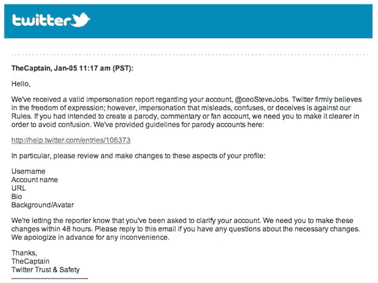
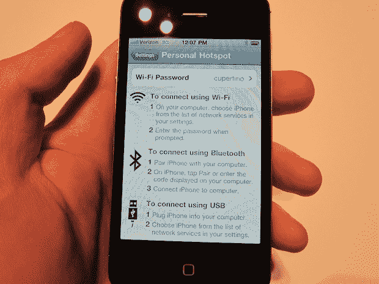
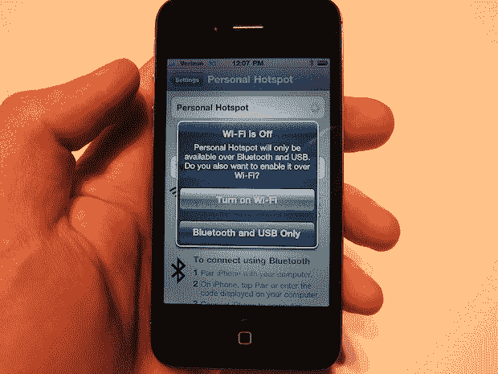
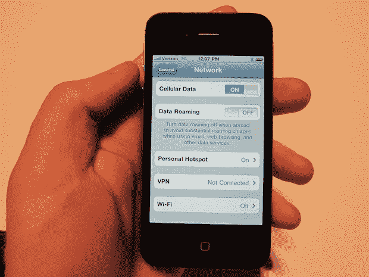

# 个人热点如何在威瑞森 iPhone 上工作(图片)

> 原文：<https://web.archive.org/web/http://techcrunch.com/2011/01/11/verizon-iphone-personal-hotspot/?utm_source=feedburner&utm_medium=feed&utm_campaign=Feed%3A+Techcrunch+(TechCrunch>&utm_content=Google+Reader)

# 个人热点如何在威瑞森 iPhone 上工作(图片)

实际上，威瑞森的 iPhone 4 和美国电话电报公司的 iPhone 4 只有一个关键区别(当然，除了网络)。但这是一个大问题:[个人热点](https://web.archive.org/web/20230203032530/https://techcrunch.com/2011/01/11/so-whats-so-special-about-the-verizon-iphone-personal-hotspots/)。是的，威瑞森 iPhone 将配备这一杀手级功能，允许它成为最多 5 个 WiFi 设备连接的互联网中心。

虽然还没有关于定价的消息(苹果和威瑞森在被反复询问时都不会让步或说漏嘴——但请注意“可能会收取额外的使用费”)，在今天的活动结束后，我们在演示室看到了它的实际应用。正如你对苹果的期望，它的设置和使用都非常简单。

正如你在上面看到的，在设置应用中有一个新的“个人热点”区域，这是[新 iOS 4.2.5](https://web.archive.org/web/20230203032530/https://techcrunch.com/2011/01/11/ios-425/) 的一部分。点击这个将启动下面的屏幕。在这里，你可以打开它，也可以设置一个密码，如果你选择设置为 Wi-Fi 使用。

但你不一定要用 Wi-Fi 连接。您也可以将个人热点设置为使用蓝牙或 USB。显然，后两者是一对一的连接。本质上，这看起来像是取代了当前 iOS 版本中的“网络共享”选项。我采访过的一位苹果公司代表认为情况也是如此。

如果你点击按钮打开 Wi-Fi，你会看到下面的屏幕弹出，确定你要打开 Wi-Fi(大概这将消耗更多的电池寿命)。

如果你打开它，你就完了。你也可以在“网络”区域看到，个人热点设置为“开”。你只需打开电脑网络设置，选择“iPhone”。

苹果公司没有透露这一功能是否会在美国电话电报公司的 iPhone 上实现。

**更多报道:**