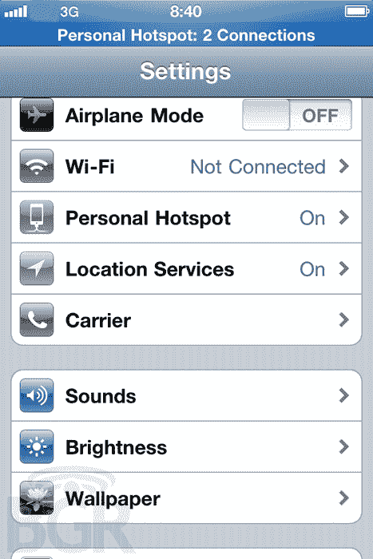

# 个人热点将于 3 月份登陆所有 iphone TechCrunch

> 原文：<https://web.archive.org/web/http://techcrunch.com/2011/01/12/personal-hotspots-coming-to-all-iphones-in-march/?utm_source=feedburner&utm_medium=feed&utm_campaign=Feed:+Techcrunch+(TechCrunch>)

# 个人热点将于 3 月份登陆所有 iPhones

[BGR 刚刚证实](https://web.archive.org/web/20230202231500/http://www.bgr.com/2011/01/12/confirmed-personal-hotspot-feature-coming-to-all-iphones-in-ios-4-3/?utm_source=BGR&utm_medium=rss&utm_campaign=Feed:+TheBoyGeniusReport+(BGR+%7C+Boy+Genius+Report))所有的 iPhones 手机，无论大小，都将很快获得个人热点功能，尽管实际实施将取决于运营商。然而，考虑到威瑞森提供这项服务的举动，我怀疑 AT & T 几乎会立即效仿。

该功能出现在将于 3 月份发布的最新版本 iOS 4.3 中。可悲的是，这意味着威瑞森将在二月份发布这款设备时有一个短暂的领先。还应该注意的是，正如一位[的推特用户所说的](https://web.archive.org/web/20230202231500/http://twitter.com/njsantana)，Android 在发布时就已经有了这个功能。

没有关于性能或价格的信息，所以在那之前我们都只能按兵不动。