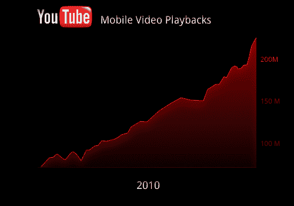

# YouTube 移动流量在 2010 年增长了两倍，Android 应用获得了音乐视频(和广告)

> 原文：<https://web.archive.org/web/https://techcrunch.com/2011/01/12/youtube-mobile-traffic-tripled-in-2010-android-app-gets-music-videos-and-ads/>

# YouTube 移动流量在 2010 年增长了两倍，Android 应用获得了音乐视频(和广告)

鉴于 YouTube 在网络上如此受欢迎，很多人也喜欢用手机观看视频片段也就不足为奇了。而且，鉴于 Android、iPhone 和 iPad 销量的激增，这些加起来就是一大堆视频。今天，YouTube 公布了人们的观看量:每天高达 2 亿的视频浏览量，是 2010 年 1 月的 3 倍。

除此之外，YouTube 还在扩大其移动内容库——但仅限于其 Android 应用。从今天开始，你将可以通过 YouTube 与 VEVO 的合作观看官方音乐视频。这包括三大唱片公司的内容:百代、UMG 和索尼，但华纳(VEVO 唯一的抵制者)的音乐视频不可用。除了音乐视频，你还可以浏览艺术家的个人资料、同一艺术家的其他曲目以及相关艺术家的作品。自 VEVO 成立以来，YouTube 就在其门户网站上提供这些音乐视频，但它们在移动设备上被屏蔽了，一个很大的原因是:内容所有者无法将它们货币化。

今天*也在*发生变化，我相信这一消息会让许多人感到懊恼。YouTube 现在将允许其内容合作伙伴(包括 VEVO 和数千家其他合作伙伴)在通过 YouTube 的 Android 应用播放的视频上播放前置式广告。广告时长 15 秒(YouTube 和合作伙伴认识到，在手机上的体验可能比在网络上更痛苦，所以我们可能不会很快看到 30 秒的广告)。虽然它们令人沮丧，但它们将增加移动中可用的优质内容的数量。

但是为什么音乐视频和广告只出现在 Android 应用中呢？YouTube 表示，它将 Android 应用程序视为测试新功能的沙盒。这也与技术限制有关:YouTube 基于 HTML5 的移动网站很好，但 YouTube 的工程师需要找到有效的方法来赚钱(在那里运行前滚动广告不像使用 Android 原生应用程序那样简单)。

