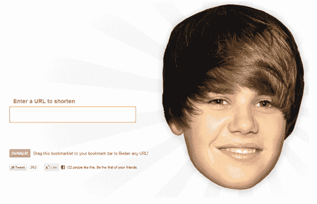

# 贾斯汀比伯网址缩写 Bieber.ly 在停止后关闭 TechCrunch

> 原文：<https://web.archive.org/web/https://techcrunch.com/2011/01/13/bieberly-justin-bieber/?utm_source=feedburner&utm_medium=feed&utm_campaign=Feed%3A+Techcrunch+%28TechCrunch%29>

# 贾斯汀比伯网址缩写 Bieber.ly 停止后关闭

今天早些时候，我们[写了](https://web.archive.org/web/20221006150436/https://beta.techcrunch.com/2011/01/13/bieber-ly-shortens-urls-while-you-look-at-a-giant-picture-of-justin-bieber/)关于[贾斯汀比伯](https://web.archive.org/web/20221006150436/http://twitter.com/#!/justinbieber)网址缩短器 [Bieber.ly](https://web.archive.org/web/20221006150436/http://www.bieber.ly/) 的报道，它有一个可疑的特点，就是把长网址缩短成更短更吸引人的 Bieber.ly。网站上线大约 22 小时后，开发者 Elliott Kember 给我们发邮件说他收到了一封“停止”信，显然是代表[“他的 Bieberness”的律师发来的](https://web.archive.org/web/20221006150436/http://technology.gather.com/viewArticle.action?articleId=281474978918587)

该网站现在写着*“啊，我们请了律师。啊，当它持续的时候，它是有趣的！不幸的是，我们被要求关闭这个网站。”*

http://twitter.com/#!/Phil sturgeon/status/2564964193483776

Kember 说,“这是我见过的最快的一封信——从发送到发邮件只用了 22 个小时。”

青少年歌手比伯和他的 700 多万“信仰者”粉丝占据了互联网上巨大而黑暗的一部分，所以比伯阵营的人会对事实上的“贾斯汀比伯网址缩写者”背后的人施加法律压力也就不足为奇了

然而令人惊讶的是，博客[“长得像贾斯汀比伯的女同性恋”](https://web.archive.org/web/20221006150436/http://lesbianswholooklikejustinbieber.tumblr.com/)仍然保持着热度。

我已经(很遗憾地)联系了贾斯汀比伯的新闻团队以获取更多信息，如果他们回复我，我会更新这个帖子(并开始申请研究生院)。

http://twitter.com/#!/Elliott kember/status/25639272417595332