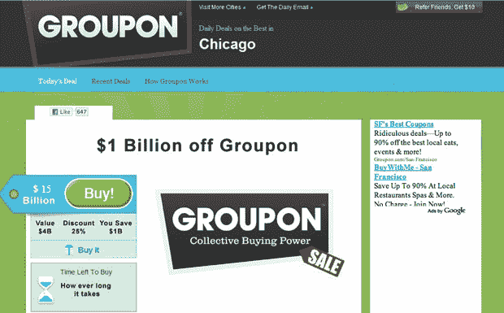

# 据说 Groupon 的估值约为 150 亿美元 TechCrunch

> 原文：<https://web.archive.org/web/http://techcrunch.com/2011/01/13/groupon-said-to-be-valued-at-like-15-billion/>

# 据说 Groupon 的估值大概是 150 亿美元

准备好更多*“Groupon 值得**什么**？！*“种反应？*纽约时报*报道[称](https://web.archive.org/web/20230202230814/http://dealbook.nytimes.com/2011/01/13/groupon-readies-for-an-i-p-o/)每日交易网站已经在认真讨论本周与华尔街上市的事宜，有传言称 IPO 将在春季进行。

这份报告还将 Groupon 的估值提高了一倍多，据报道，几个月前谷歌曾出价 60 亿美元收购该公司，现在该公司的估值约为 150 亿美元或更多

来自《纽约时报》的报道:

> “如果成功的话，对这家由 30 岁的创始人安德鲁·梅森(Andrew Mason)领导的年轻创业公司来说，这将是一个重要的里程碑，他古怪的个性帮助塑造了这个网站。此次发行也将是自 2004 年谷歌上市以来最受期待的一次，也将代表该公司迄今为止的最高估值。

据《T21 时报》报道，Groupon 正在蓬勃发展，最近从投资者那里筹集了 9.5 亿美元，如 Greylock Partners、Kleiner Perkins 和 Morgan Stanley，这是创业公司有史以来最大的一轮融资。

Groupon 最近积极关注其国际扩张计划，今天也达到了一个不太引人注目的里程碑，通过使用 Groupons 节省了超过 10 亿美元。

以下是 Groupon 首席执行官安德鲁·梅森(Andrew Mason)在接受 Crain 的[“40 岁以下:2009 年”的采访，他是团购兴起背后的*“古怪的个性”*。](https://web.archive.org/web/20230202230814/http://www.chicagobusiness.com/40under40-2009/index.html#mason)

【YouTube = http://www . YouTube . com/watch？v=ZNSLhO5U05E&w=630]

图片: [Groupon 换 Groupon](https://web.archive.org/web/20230202230814/http://www.grouponforgroupon.com/)