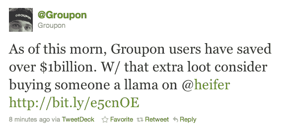

# Groupon:我们现在已经为用户节省了超过 10 亿美元

> 原文：<https://web.archive.org/web/http://techcrunch.com/2011/01/13/groupon-weve-now-saved-users-over-1-billion-sort-of/>

# Groupon:我们现在已经为用户节省了超过 10 亿美元(算是)

[Groupon](https://web.archive.org/web/20230202231723/http://www.groupon.com/) ，一个非常受欢迎的交易分享网站，最近筹集了[高达 9.5 亿美元](https://web.archive.org/web/20230202231723/https://techcrunch.com/2011/01/10/groupon-raises-like-a-billion-dollars/)的资金，刚刚[宣布了](https://web.archive.org/web/20230202231723/http://twitter.com/#!/Groupon/status/25668330341801984)一个令人印象深刻的里程碑:用户通过网站的销售“节省”了超过 10 亿美元。

Groupon 的日常交易通常会有 50%或更多的大幅折扣——Groupon 可能会合计所有这些折扣，以达到其 10 亿美元的统计数据。当然，这个网站并不完全是在为你省钱，因为它的热卖经常会让人们购买他们不会购买的东西(我仍然在想我会用我的 50 美元艺术用品代金券做什么)。

无论如何，这是一笔不小的销售额。

去年 12 月，Groupon 拒绝了谷歌提出的约 60 亿美元的收购要约。之后，他们没有浪费任何时间筹集新的 9.5 亿美元。

如果你感兴趣，你真的可以用[小母牛](https://web.archive.org/web/20230202231723/http://www.heifer.org/site/c.edJRKQNiFiG/b.204586/)给世界各地的家庭送去一只美洲驼(或绵羊或山羊)。