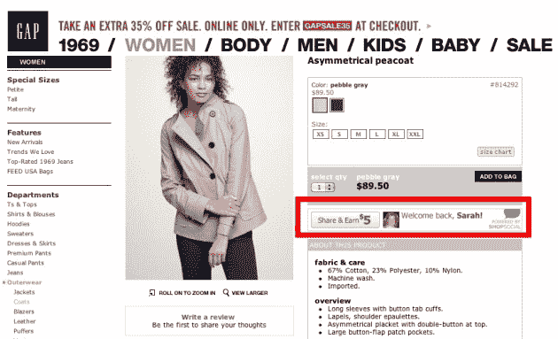

# ShopSocial 因其“商务即社交服务”理念筹集了 120 万美元 TechCrunch

> 原文：<https://web.archive.org/web/http://techcrunch.com/2011/01/13/shopsocial-funding/?utm_source=feedburner&utm_medium=feed&utm_campaign=Feed:+Techcrunch+(TechCrunch>)

# ShopSocial 为其“商业即社会服务”的想法筹集了 120 万美元

[ShopSocial](https://web.archive.org/web/20230203025102/http://www.shopsocial.com/) ，由 [BuzzLogic](https://web.archive.org/web/20230203025102/http://www.crunchbase.com/company/buzzlogic) 联合创始人 [Todd Parsons](https://web.archive.org/web/20230203025102/http://www.crunchbase.com/person/todd-parsons) 创办的最新企业，已经筹集了[120 万美元](https://web.archive.org/web/20230203025102/http://www.crunchbase.com/company/shopsocial)的融资。

该公司正在建立一个平台，称其聚合了广告、商业和社交推荐，但不要与 shop socially(T10)混淆。

通过浏览 ShopSocial 网站，你无法了解它的很多计划，但帕森斯简要演示了这个平台，在我看来，它肯定有一些潜力。

基本上，ShopSocial 使品牌和商家能够在展示广告单元或产品页面中包含按钮，使人们能够与朋友分享和推荐产品和服务(通过电子邮件、脸书或 Twitter)。

作为分享的回报，帮助分配商品交易的人会获得奖励，这最终会以多种形式出现(比如亚马逊礼品卡、广告商出售商品的直接折扣等。).

帕森斯是这样说的:

> “我们的目标是推动社交商务，并在客户喜欢参与的任何环境中为品牌提供奖励。”

除了一种分销手段，ShopSocial 表示，它还可以在任何实现“销售窗口”的网站上实现安全交易(如某一特定产品的限时销售或集体购买)。

您可以在下面找到一些截图，但请注意，这些是演示，而不是现场实施，ShopSocial 将在本季度开始推出。

这轮融资由[变质风险投资](https://web.archive.org/web/20230203025102/http://www.crunchbase.com/financial-organization/metamorphic-ventures-llc)牵头，X/种子资本以及几名未透露姓名的天使投资人参与。

