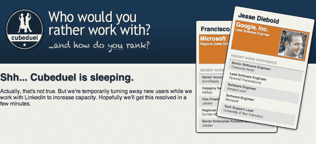

# Cubeduel 传播太快，被 LinkedIn API 限制绊倒 TechCrunch

> 原文：<https://web.archive.org/web/https://techcrunch.com/2011/01/14/cubeduel-goes-viral-too-quickly-stumbles-over-linkedin-api-limits/>

# Cubeduel 传播得太快，超过了 LinkedIn API 的限制

昨天我们[发表了一篇关于](https://web.archive.org/web/20230203002010/https://techcrunch.com/2011/01/13/cubeduel-hot-or-not-meets-linkedin-your-darker-side-will-love-it/) [Cubeduel](https://web.archive.org/web/20230203002010/http://www.cubeduel.com/) 的帖子，这是一项将热门与否的最佳(或最差)之处与 LinkedIn 相结合的服务。打开这个网站，它会向你展示两个同事的照片——选择一个你喜欢的同事，然后 Cubeduel 会向你展示另一对照片。它会让人上瘾，有点邪恶，自从发布以来，在过去的几天里使用量直线上升。不幸的是，它起飞得有点太快了。

这项服务[今天早些时候关闭](https://web.archive.org/web/20230203002010/http://www.techflash.com/seattle/2011/01/linkedin-shut-downs-cubeduel-co-worker.html),原因最初还不清楚 LinkedIn 屏蔽该网站是因为它对同事的排名方式并不讨好所有人，还是该网站太受欢迎、太快了？结果是后者——cube duel 已经超过了 LinkedIn 的 API 限制(这是该网站的创始人之一托尼·赖特最初的猜测)。以下是 LinkedIn 交流总监 Hani Durzy 的解释:

> 我们没有关闭 Cubeduel。该应用程序使用我们开放的 LinkedIn 开发者平台，该平台有公开记录的每日访问限制。我们的开发人员平台限制旨在保护我们的成员，自一年前平台计划推出以来就一直存在。我们正在与 Cubedeal 背后的人沟通，讨论他们如何向前发展。我们总是有兴趣看到我们的平台被开发者以创新的方式使用。

我接着问这个网站是否可以被允许超出标准 API 限制，或者 Cubeduel 是否必须找到一种方法来重组这个网站以适应正常的限制。这个问题的答案还不清楚——dur zy 说他们仍然在互相交谈。

Wright 表示，在 API 达到上限之前，Cubeduel 远远超出了他的预期——他昨天告诉我，到本周末，该网站将获得“数十万”排名用户。现在，他说，在 API 限制生效之前，它们已经“离数百万只不远了”。