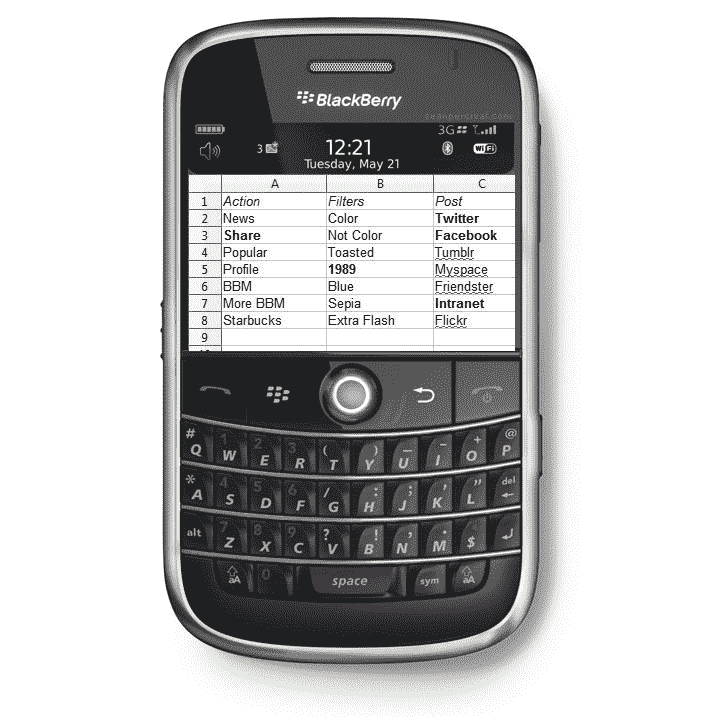

# 黑莓的 Instagram 截图 TechCrunch

> 原文：<https://web.archive.org/web/http://techcrunch.com/2011/01/14/instagram-for-the-blackberry/?utm_source=feedburner&utm_medium=feed&utm_campaign=Feed%3A+Techcrunch+(TechCrunch>)

# 黑莓手机的 Instagram 截图]

受黑莓史诗[版《愤怒的小鸟》的启发，Myspace 副总裁](https://web.archive.org/web/20230202232904/http://gizmodo.com/5640898/this-is-how-angry-birds-would-look-on-blackberry)[肖恩·帕西瓦尔](https://web.archive.org/web/20230202232904/http://www.seanpercival.com/)想出了一个模拟的假想，关于流行的图片分享应用 [Instagram](https://web.archive.org/web/20230202232904/http://www.instagr.am/) 在文本量大、相机功能弱的黑莓平台上会是什么样子。再加上刚刚冲击[一百万下载量](https://web.archive.org/web/20230202232904/https://techcrunch.com/2010/12/21/instagram-one-million/)的 Instagram 还没有在 Android 上推出，上面这张图显得特别幽默。

然而，珀西瓦尔在这里的最终信息旨在超越幽默，因为他实际上是将图片作为实验[发布到 Instagram 上](https://web.archive.org/web/20230202232904/http://instagr.am/p/BA-69/)，*“随着如此多的品牌进入 Instagram，我很好奇一个幽默(或病毒)内容在 Instagram 生态系统本身中会如何。毫无疑问，这些品牌需要带来一些东西，而不仅仅是一张经过完美过滤的小猫照片，才能产生影响。”*

最近，在 Instagram 上用“喜欢”来“流行”或传播已经成为技术界的一种地位象征，无论多么巧妙，要让人们“喜欢”一张 Peets 或星巴克标志的品牌照片，需要一些相当有创意的策略。