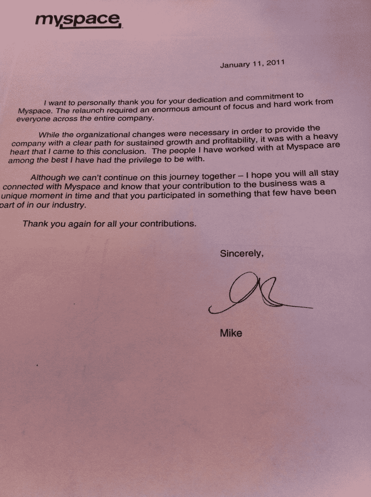

# 迈克·琼斯写给被解雇的 MySpacers 用户的告别信:“我们不能继续在一起了”

> 原文：<https://web.archive.org/web/https://techcrunch.com/2011/01/14/myspace-kiss-off-letter-laid-off/>

# 迈克·琼斯写给被解雇的 MySpacers 员工的告别信:“我们不能继续在一起了”

每当一家公司裁员 500 人时，就像 MySpace 本周早些时候解雇一半员工那样，都会引发相当多的[愤怒和怨恨。我们收件箱里一位沮丧的前雇员提供的最新提示详细描述了那些无所事事的经理们，当他们所有的下属都失业时，他们还在工作。](https://web.archive.org/web/20221007144353/https://beta.techcrunch.com/2011/01/11/bitterness-anger-and-betrayal-at-myspace/)

我不会在这里重复人格暗杀，但前 MySpacer 确实包括一些其他的东西，我会分享:来自首席执行官迈克·琼斯的告别信。“他甚至没有花时间亲自在信上签名。这位前雇员哀叹道:“这只是一份复印件。”。你可以阅读下面的解雇信。这是相当标准的，感谢那些被解雇的人“对 MySpace 的奉献和承诺”，特别是通过最近的[重新启动](https://web.archive.org/web/20221007144353/https://beta.techcrunch.com/2010/10/26/myspace-redesign-details/)。

这是一部分，虽然这一定很令人恼火:

> 虽然我们不能继续一起踏上这一旅程，但我希望你们都与 MySpace 保持联系，并知道你们对这一业务的贡献是一个独特的时刻，你们参与了我们行业中很少有人参与的事情。

那到底是什么？装扮 MySpace [进行出售](https://web.archive.org/web/20221007144353/http://www.bloomberg.com/news/2011-01-12/myspace-sale-merger-or-spinoff-being-weighed-by-news-corp-official-says.html)，然后裁掉一半员工，让其下滑的财务状况看起来更诱人一点？是啊，特殊时期。

