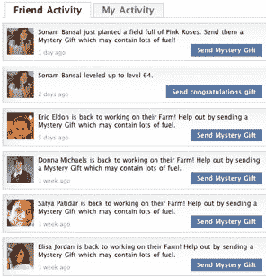

# 脸书应该从微软的剧本 TechCrunch 学到什么

> 原文：<https://web.archive.org/web/http://techcrunch.com/2011/01/15/facebook-microsoft-playbook/>

***编者按**:这篇客座博文由 [Raj Lalwani、](https://web.archive.org/web/20230202230723/http://www.crunchbase.com/person/raj-lalwani)Hallmark Social Calendar(原 [Social Calendar](https://web.archive.org/web/20230202230723/http://www.crunchbase.com/company/social-calendar) )的联合创始人兼首席执行官撰写，这是一款脸书上的[生日提醒应用](https://web.archive.org/web/20230202230723/https://techcrunch.com/2009/11/16/hallmark-expands-presence-on-facebook-with-socialcalendar-partnership/)。*

2007 年，当脸书向开发者开放其平台时，脸书似乎在使用微软的剧本——让开发者使用他们的平台创建应用程序，并看看哪些应用程序成功了(就像微软对 Lotus 1-2-3、WordPerfect 和哈佛图形所做的那样)。然后收购或者克隆成功的(微软 Excel、Word、PowerPoint)作为摇钱树，把面包屑(相对而言)留给别人。但似乎有些地方出了问题——第三方应用生态系统并不繁荣，脸书仍然没有像微软那样的摇钱树(Office 和 Windows)。

相反，脸书越来越像雅虎了。—从照片和聊天到电子邮件和位置，它无所不包。它提供的功能刚刚够用，但还有很多不足之处，而且越来越依赖广告作为收入模式。

直到最近，微软在技术领域还拥有最大的市值(现在是苹果)。以下是脸书应该从微软的剧本中借鉴的东西。

**脸书必须确保第三方应用生态系统繁荣发展**

这很重要，原因有二。首先，它为用户保持了平台的活力——如果所有的应用程序都来自微软，Windows 将不会非常有趣或成功。第二，成功的想法将来自这个生态系统。如果脸书平台对应用开发者不可行，他们将继续寻找替代品，迟早有人会在别处破解社交图谱代码。例如，苹果的 iPhone 正在成为应用开发者的一个有意义的平台。

当谈到被一些应用程序开发者滥用的沟通渠道时，脸书似乎把婴儿和洗澡水一起扔了出去。我以前在脸书玩过拼字游戏。我最近试着玩拼字游戏，但是另一个玩家没有被通知该她走了！从那以后，我开始在 iPhone 上和朋友玩文字游戏，而且效果很好。只要我的朋友有所行动，我就会收到推送通知。脸书应该像在墙上发布通知一样处理通知——请求用户明确允许向朋友发送通知。

新闻源故事增加了应用的参与度和发现度。但是产生的大量故事迫使脸书用算法来决定在主页上显示什么样的故事。你最近去过 FarmVille 或 Causes 吗？他们都在主页上突出显示朋友的活动。为什么？与脸书如此成功的原因相同——用户可以看到他们的朋友在做什么——社会发现、社会证明和窥淫癖的爆炸性结合。这就是我认为解决脸书和应用开发者之间新闻报道之争的办法。脸书应该提供一种简单的方式，在应用程序内部显示特定于应用程序的新闻，而不是每个应用程序都试图实现自己的好友活动。与此同时，脸书应该继续在其主页上推出有趣的故事。

这就留下了应用程序发现的问题——接触尚未成为应用程序用户的新用户。如果社交发现将成为脸书的杀手级应用(我马上会谈到)，应用发现只是其中的一小部分。像脸书以前做的那样，在个人资料上显示用户使用的应用程序是一个好的开始。但是说到发现，脸书可以借鉴另一个剧本:谷歌的。一些开发者会很乐意为线索付费。赞助链接就在应用程序使用列表的上方怎么样？

脸书必须尽快找到它的摇钱树

对我来说，像 FarmVille 这样的社交游戏就像一棵摇钱树。脸书应该收购或者克隆 Zynga。似乎脸书选择了一个平台角度，即广告和脸书信用，这有可能成为脸书的摇钱树。

然而，我相信，“社交发现”是脸书潜在的杀手级应用。如果你像我一样，你会发现新的餐馆，因为一个朋友推荐或带你去那里。我总是问我的朋友关于新电影的事情——我知道哪些朋友和我有相似的品味，哪些我可以放心地忽略。这个清单延伸到电视节目、水管工、书籍、音乐、厨房用具和小工具。(脸书的照片应用程序变得如此受欢迎，主要是因为社交发现朋友上传的新照片。标记只是一种便于发现的机制。)当我买了一本关于 Amazon.com 的书时，我应该能够为我的朋友们发表一个故事(但不是自动的故事——还记得 Beacon 吗？).当我的任何一个朋友点击行动链接或完成交易时，亚马逊就会向脸书付款。这种赞助源项目应该被清楚地标记和突出显示，就像谷歌上的赞助链接一样。

脸书应该借鉴微软的剧本，使其平台对开发者更加友好，但也可以加入一点谷歌的赞助链接，并将其应用于社交发现。