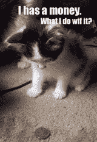

# 我可以拥有资金:Cheezburger 为 LOLcats、FAIL Blog 和其他 Memes 筹集了 3000 万美元

> 原文：<https://web.archive.org/web/http://techcrunch.com/2011/01/17/i-can-has-funding-cheezburger-raises-30m-for-lolcats-fail-blog-and-other-memes/>

# 我可以拥有资金:Cheezburger 为 LOLcats、FAIL Blog 和其他 Memes 筹集了 3000 万美元

 [Cheezburger](https://web.archive.org/web/20230313111205/http://cheezburger.com/) ，负责 [LOLcats](https://web.archive.org/web/20230313111205/http://icanhascheezburger.com/) 、 [FAIL Blog](https://web.archive.org/web/20230313111205/http://failblog.org/) 和其他 memes 的互联网出版商，已经筹集了高达 3000 万美元的新资金，由 [Foundry Group](https://web.archive.org/web/20230313111205/http://www.crunchbase.com/financial-organization/foundry-group) 牵头，还有 [Madrona Venture Group](https://web.archive.org/web/20230313111205/http://www.crunchbase.com/financial-organization/madrona-venture-group) 、 [Avalon Ventures](https://web.archive.org/web/20230313111205/http://www.crunchbase.com/financial-organization/avalon-ventures) 和 [SoftBank Capital](https://web.archive.org/web/20230313111205/http://www.crunchbase.com/financial-organization/softbank-capital) 参与此轮投资。Foundry Group 的 Brad Feld 、Madrona Venture Group 的 Greg Gottesman 和 Avalon Ventures 的 Rich Levandov 将加入 Cheezburger 的董事会。这笔最新投资使这家初创公司的总资金达到 3250 万美元

由前记者[本·哈](https://web.archive.org/web/20230313111205/http://www.crunchbase.com/person/ben-huh)于 2007 年创立的 Cheezburger 已经从一个小网站成长为一个拥有 50 个网站的网络，将互联网迷因和科技文化带入主流。Cheezburger 的网站网络共有 1650 万用户，每月上传超过 50 万张图片和视频，观看 3.75 亿个页面和 1.1 亿个视频。

除了幽默，Cheezburger 的成功可以部分归因于 Huh 是一个精明的商人。嗯[真的收购了](https://web.archive.org/web/20230313111205/https://techcrunch.com/2009/10/28/five-things-that-may-shock-you-about-the-lolcats-network/)我能拥有 Cheezburger 吗？和失败的博客，并稳步建立其网络。该公司自成立以来一直盈利，收入来自三个来源——广告、包括书籍在内的传统媒体出版和商品销售。

去年，Huh 提出从 Conde Nast 手中收购 Reddit，仅用三年时间就建立了这个幽默帝国。

那么 Cheezburger 打算用这些钱做什么呢？他告诉 is，这笔资金将用于“雇佣、雇佣、再雇佣”，希望将公司现有员工扩充至 50 人。Huh 关注的另一个领域是国际扩张，总部位于日本的软银资本(Softbank Capital)鉴于其投资，对这一领域特别感兴趣。

就实际站点扩展而言，Huh 说他很难想象 Cheezburger 会有数百个站点，但他确实认为该网络可能会在一年内扩展到不到一百个站点。最后，Huh 解释说，这不是关于幽默网站和模因的数量，而是关于为每个网站的访问者提供优质的体验。

当然，这笔资金也将用于基础设施和技术，以减轻 Cheezburger 的数百万用户和游客。Huh 计划推出官方的 iPhone 和 Android 应用程序，并将推出一个改进的工具来为照片添加标题。

当被问到他未来的目标是什么时，Huh 的回答很简单。“我希望 Cheezburger 成为互联网文化的最终领导者和影响者，”他解释道。"就我们所能做的而言，我们只达到了冰山一角。"

图片来源/ [Lolcats](https://web.archive.org/web/20230313111205/http://icanhascheezburger.com/2007/05/30/i-has-a-money/)