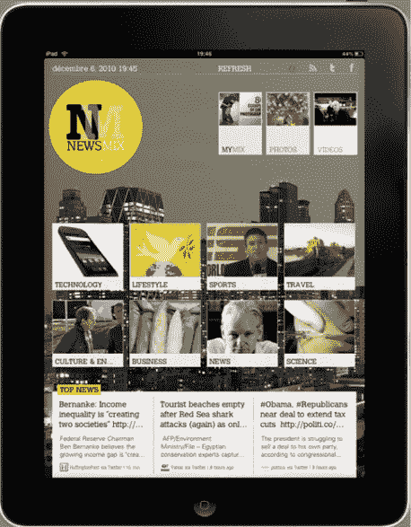

# Sobees 推出 iPad 应用 NewsMix，这是一份社交策划数字杂志 TechCrunch

> 原文：<https://web.archive.org/web/http://techcrunch.com/2011/01/17/sobees-launches-ipad-app-newsmix-a-socially-curated-digital-magazine/>

# Sobees 推出 iPad 应用 NewsMix，这是一份社交策划的数字杂志

Sobees 致力于创造[创新的社交媒体客户端，](https://web.archive.org/web/20230202235404/https://techcrunch.com/2010/05/11/sobees-launches-ipad-app-for-facebook/)尤其专注于将 Twitter、脸书和[社交搜索](https://web.archive.org/web/20230202235404/https://techcrunch.com/2010/01/22/sobees-launches-realtime-social-media-discovery-platform/)引入各种平台。如今，随着 NewsMix 的推出，开发者开始涉足新闻业务。news mix 是一款 iPad 应用，它以杂志的形式在设备上展示你的社交圈分享的新闻和内容。

这款应用在 App Store 售价 2.99 美元，允许你创建和混合由你的 Twitter、脸书和 RSS 订阅源(谷歌
阅读器和订阅源搜索)中共享的内容组成的数字杂志。该应用程序将对杂志中的内容进行分类，或者以独立的时间线格式为脸书和 Twitter 显示新闻。您可以在单独的部分查看照片和视频。

在社交功能方面，该应用允许你直接从杂志上评论和喜欢脸书的帖子，你可以同时在 Twitter 和脸书上分享文章。该应用程序还允许你通过电子邮件发送内容和文章到 Instapaper。

Sobees 创始人 Francois Bochatay 表示，该应用程序包含该初创公司的专有策展技术，该技术将根据你与应用程序的互动，自动对 Twitter 和脸书的帖子进行优先排序和策展。

当然，NewsMix 听起来非常类似于非常受欢迎的 iPad 应用程序 Flipboard，它也从 Twitter 和脸书等社交媒体上收集文章和图片，并以类似杂志的形式呈现出来。[脉冲也在空间中发挥](https://web.archive.org/web/20230202235404/https://techcrunch.com/2010/12/01/pulse-ipad-facebook/)的作用。

【YouTube = http://www . YouTube . com/watch？v=569LfxiOp08&fs=1&hl=en_US]