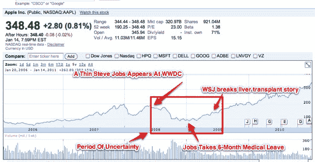

# 谈到史蒂夫·乔布斯的健康，有一件事是肯定的:华尔街讨厌不确定性

> 原文：<https://web.archive.org/web/http://techcrunch.com/2011/01/17/steve-jobs-health-uncertainty/>

# 谈到史蒂夫·乔布斯的健康，有一件事是肯定的:华尔街讨厌不确定性

你可能已经听说了，史蒂夫·乔布斯正在休另一次病假。他最后一次服药是在 2009 年 1 月，服药时间是[六个月](https://web.archive.org/web/20230202232303/https://techcrunch.com/2009/01/14/steve-jobs-takes-six-month-leave-of-absence-from-apple/)，结果是[肝移植](https://web.archive.org/web/20230202232303/https://techcrunch.com/2009/06/19/not-only-was-steve-jobs-sick-he-had-a-liver-transplant/)，可能与他之前的胰腺癌有关。这一次休假是无限期的，苹果公司不会对他的情况进行任何进一步的详细说明。

华尔街讨厌的一件事就是不确定性。看看从 2008 年 6 月到 2009 年 6 月(当时非常瘦的史蒂夫·乔布斯出现在苹果全球开发者大会上，引发了人们对他健康状况的猜测)，从他随后的休假到 2009 年 6 月(当时《华尔街日报》报道他接受了肝移植)，苹果公司的股票发生了什么变化。在那段不确定时期，股价下跌了 23%，甚至更低(见图表)。这一次苹果的股票会再次下跌吗？

该股在海外市场已经下跌，但披露的时机似乎是为了尽可能减少这一消息的影响。这一宣布正值苹果市值达到历史最高水平，更不用说美国市场休市的假日(MLK 日)，就在苹果预计宣布另一个突破性季度之前。

最终，苹果股价与史蒂夫·乔布斯健康的关系取决于几件事:在他不在的时候，苹果会如何表现；他要去多久；他的病情有多严重；什么时候会有更多的消息？但最重要的是，这取决于苹果目前 3200 亿美元的市值中有多少与史蒂夫·乔布斯的继续领导有关。

苹果的势头看起来足够强劲，可以通过稳定的产品更新度过 2011 年，其产品路线图可能会在未来几年内制定(MG 在[这篇文章](https://web.archive.org/web/20230202232303/https://techcrunch.com/2011/01/17/steve-jobs-apple-tim-cook-2011/)中有更多相关内容)。但是整个计算机行业正处于向移动、触摸设备的重大转变的尖端——这在很大程度上要感谢苹果和乔布斯。苹果在这方面处于领先地位，但如果乔布斯不全力以赴，它能继续抵挡住行业的其他对手吗？我们很快就会知道了。

请记住，苹果在之前就已经[在这个位置了。乔布斯回来了，它继续蓬勃发展。希望历史会重演。](https://web.archive.org/web/20230202232303/https://techcrunch.com/2009/01/15/apple-the-religion-steve-jobs-the-man/)