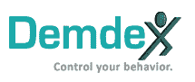

# Adobe 收购行为数据管理平台 DemDex TechCrunch

> 原文：<https://web.archive.org/web/https://techcrunch.com/2011/01/18/adobe-buys-behavioral-data-management-platform-demdex/>

# Adobe 收购行为数据管理平台 DemDex

 Adobe 今天刚刚[宣布](https://web.archive.org/web/20230203021040/http://www.businesswire.com/news/home/20110118007173/en/Adobe-Acquires-Demdex-%E2%80%93-Brings-Audience-Optimization)一笔大收购；购买行为数据库 [DemDex。](https://web.archive.org/web/20230203021040/http://www.demdex.com/)协议条款没有在新闻稿中披露。

Demdex 代表网站和广告商捕捉行为数据，并将其存储在“行为数据库”中。然后，该公司通过 40 多个行为和人口统计变量对每个用户进行评分，以得出“traitweight”，这有助于网站更好地细分受众，广告商更准确地锁定他们的信息。

DemDex 的美妙之处在于，它让行为数据变得可移植，并将其置于网站和广告商自己的控制之下。他们可以将它插入他们当前使用的任何广告服务器或服务中。

DemDex 的技术将被添加到 Adobe 的在线营销套件中，该套件由 Adobe 收购的 Omniture 提供支持。当然，Adobe 希望通过其营销套件提供广告优化来抓住价值 1，090 亿美元的在线广告市场。当然，应该注意的是，DemDex 收集的数据是基于匿名 cookie IDs 的，消费者可以选择不接收定向广告。

对于 2009 年才推出的 DemDex 来说，这是一个相当快速的退出。这家初创公司已经筹集了总计[750 万美元](https://web.archive.org/web/20230203021040/https://techcrunch.com/2010/05/10/demdex-6-million/)的资金。