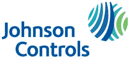

# 汽车电池制造商江森自控在南卡罗来纳州建造 1.5 亿美元的回收工厂 TechCrunch

> 原文：<https://web.archive.org/web/http://techcrunch.com/2011/01/18/jci-battery-recycling-facility-sc/>

# 汽车电池制造商江森自控(Johnson Controls)在南卡罗来纳州投资 1.5 亿美元建造回收工厂

汽车零部件和电池制造商江森自控公司今天在南卡罗莱纳州佛罗伦萨的一家新电池回收厂[T2 破土动工。2010 年 8 月，当地和国家环保组织与该公司就空气排放标准达成共识，允许该公司开始实施其建设 1.5 亿美元设施的计划，该设施占地 270 英亩，其中约 36 英亩。](https://web.archive.org/web/20230202232134/http://www.florencerecyclingcenter.com/)

江森自控的多名发言人[指出](https://web.archive.org/web/20230202232134/http://www.prnewswire.com/news-releases/johnson-controls-air-permit-for-battery-recycling-center-in-florence-sc-becomes-effective-99833394.html)这些许可是二十年来第一次授予“美国一个新的、完全整合的电池回收设施”。

在电池回收中心的新闻发布之前，江森自控(在本月早些时候的底特律车展上)推出了一种用于电动和混合动力汽车的新型锂离子电池，该电池在密歇根州[荷兰](https://web.archive.org/web/20230202232134/http://www.wzzm13.com/news/most_popular_story.aspx?storyid=148609&provider=top)制造。

江森自控与法国合作伙伴 Saft 在国内生产锂离子电池。福特同意购买密歇根制造的电池，用于他们的电动和混合动力汽车。

2009 年通过《美国联邦复苏和再投资法案》获得的 2.992 亿美元拨款激励江森自控在国内建立工厂，即生产镍钴金属电池单元和电池组，以及混合动力和电动汽车的电池隔板(与合作伙伴 Entek 合作)。

然而，江森自控在南卡罗来纳州的电池回收业务却没有得到联邦刺激拨款的补贴。在“加速美国下一代电池和电动汽车的制造和部署”项目上花费的 24 亿美元中，只有 950 万美元流向了加利福尼亚州阿纳海姆的回收企业 TOXCO Inc .