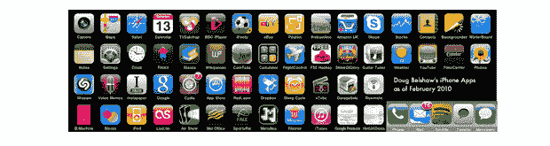

# 报告:到 2015 年，移动应用市场将价值 250 亿美元——苹果的份额:20%

> 原文：<https://web.archive.org/web/http://techcrunch.com/2011/01/18/report-mobile-app-market-will-be-worth-25-billion-by-2015-apples-share-20/?utm_source=feedburner&utm_medium=feed&utm_campaign=Feed%3A+Techcrunch+(TechCrunch>&utm_content=Google+Reader)

# 报告:到 2015 年，移动应用市场将价值 250 亿美元——苹果的份额:20%

我们都知道移动应用商店正在全球范围内蓬勃发展，而由 [MarketsandMarkets](https://web.archive.org/web/20230202231258/http://www.marketsandmarkets.com/) 发布的一份新的市场研究报告也承认了这一趋势。根据该研究公司的[“世界移动应用市场(2010–2015)”](https://web.archive.org/web/20230202231258/http://www.marketsandmarkets.com/Market-Reports/mobile-applications-228.html)报告，到 2015 年，全球移动应用市场总额预计将达到 250 亿美元(高于 2010 年的 68 亿美元)。

MarketsandMarkets [预计](https://web.archive.org/web/20230202231258/http://www.prnewswire.com/news-releases/marketsandmarkets-world-mobile-applications-market-worth-us25-billion-by-2015-114087839.html)苹果的应用程序商店将占据这块蛋糕的近 20.5%，而全球市场预计将在 2009 年至 2014 年间创下 29.6%的 CAGR(复合年增长率)。

该研究公司重申了推动这一增长的各种因素，从网络技术的进步到移动数据使用成本的降低，[智能手机在全球的日益普及，以及应用程序可用性的不断提高。](https://web.archive.org/web/20230202231258/https://techcrunch.com/2011/01/11/report-number-of-mobile-broadband-subscriptions-to-surpass-1-billion-in-2011/)

MarketsandMarkets 认为，手机应用程序中的网络钓鱼和间谍软件带来的数据窃取风险是可用应用程序和可用手机数量激增的最大不利因素。

根据该报告，北美自 2009 年以来以 41.6%的收入份额领先市场。然而，亚洲是下载量最大的市场，占 36%。

欧洲移动应用市场在 2009 年达到 12 亿美元，但预计到 2015 年将成为最大的市场，达到 84 亿美元，并在 2010-2015 年期间以 33.6%的 CAGR 增长。

该公司将全球移动应用设备市场细分为甲板上(即运营商管理的)和甲板外移动应用(直接向消费者销售)子市场。MarketsandMarket 表示，前者是较大的部分，约占全球移动应用收入的 75%。

然而，该研究公司补充说，由于进入门槛的降低和新独立商店的快速建立，非甲板移动应用市场预计将在未来经历更快的增长。MarketandMarkets 预计，到 2015 年底，场外移动应用商店的下载量将超过场内商店。

有关此主题的更多报告，请查看:

[报告:到 2015 年，游戏内购买将使手机游戏收入突破 110 亿美元](https://web.archive.org/web/20230202231258/https://techcrunch.com/2010/11/30/report-in-game-purchases-to-blow-mobile-games-revenues-past-11-billion-by-2015/)

还有[这么多免费的！:苹果公司将在 2011 年销售价值 100 美元的 2B 应用软件](https://web.archive.org/web/20230202231258/https://techcrunch.com/2010/12/30/so-much-for-free-apple-will-sell-2b-in-apps-in-2011/)

(图片来自 [Flickr 用户 dougbelshaw](https://web.archive.org/web/20230202231258/http://www.flickr.com/photos/dougbelshaw/4360008898/) )