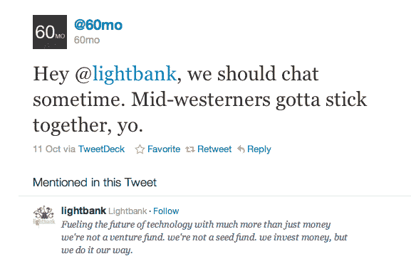

# 在一条决定性的推文之后，60mo 从 Lightbank 获得了 A 轮融资

> 原文：<https://web.archive.org/web/http://techcrunch.com/2011/01/19/after-a-fateful-tweet-60mo-raises-series-a-from-lightbank-yo/?utm_source=feedburner&utm_medium=feed&utm_campaign=Feed%3A+Techcrunch+(TechCrunch>)

# 在一条决定性的推文之后，60mo 从 Lightbank 筹集了 A 轮融资

去年 10 月，金融追踪初创公司 [60mo](https://web.archive.org/web/20230202231656/http://www.60mo.com/) 给 Lightbank 发了一条[推文](https://web.archive.org/web/20230202231656/http://twitter.com/#!/60mo/status/27045586012)，上面写道:“*嘿@lightbank，我们应该找个时间聊聊。中西部人必须团结一致。*”

三个月后，Lightbank 给出了回复:“fo sho”。

今天，60mo 宣布完成了由 Lightbank 牵头的首轮融资。交易的具体细节没有透露，但我们被告知“在一百万美元的范围内”。是的，那条推特实际上是这两个组织第一次互相交流。

我们在之前[报道过的 60mo 是一项在线服务，它通过从 QuickBooks、FreshBooks 和各种金融机构(如美国银行、大通银行和美国运通)导入数据来帮助企业管理财务。一旦数据进入系统，你可以使用 60mo 创建财务预测，管理你的企业预算，并与你的会计师或投资者分享数据——这有点像企业的](https://web.archive.org/web/20230202231656/https://techcrunch.com/2010/10/08/60mo-gives-quickbooks-a-minty-dashboard/)[造币厂](https://web.archive.org/web/20230202231656/http://www.mint.com/)。

自从我们上次写了他们，60mo 已经推出了一个新的设计，他们也调整了他们的价格。这项服务最初起价为每月 19 美元，现在涨到了每月 29 美元，但是 60mo 推出了一个新的免费选项，尽管功能有限(你只能用一个银行账户或信用卡连接)。还有一个新的 30 天试用期。

Lightbank 是一家由埃里克·莱夫科夫斯基和布拉德·基威尔创立的投资公司，他们两人还共同创立了 Groupon 等公司。

这一领域的另一个竞争对手是 inDinero。

