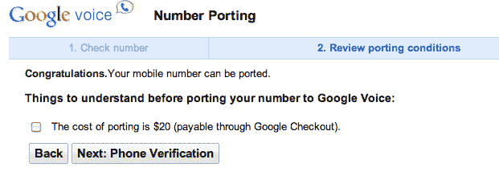
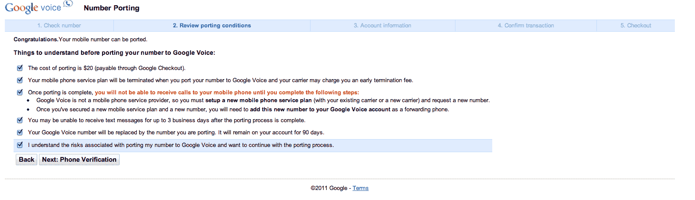

# 谷歌语音即将起飞:20 美元的数字移植即将推出 TechCrunch

> 原文：<https://web.archive.org/web/http://techcrunch.com/2011/01/19/google-voice-is-about-to-take-off-number-porting-enabled-for-20/?utm_source=feedburner&utm_medium=email&utm_campaign=Feed%3A+Techcrunch+(TechCrunch>)

我们是谷歌语音的忠实粉丝已经有一段时间了——它让过滤来电和管理多部手机变得轻而易举——但它一直有一个巨大的缺点:它不允许人们转移现有的电话号码。换句话说，为了利用谷歌语音的所有优势，你必须获得一个新的电话号码。现在，经过多年的等待，这种情况终于改变了:谷歌已经悄悄地为谷歌语音启用了号码移植。

**更新**:谷歌告诉我们，这目前只是对一些用户的测试，还没有推广到所有人。然而，大规模的发布似乎很快就会到来。

这是谷歌的一份声明:

> “我们不断测试新功能，以增强用户体验。在有限的时间内，我们将向用户开放谷歌语音号码移植流程。我们目前没有任何其他细节可以分享，但计划在不久的将来向所有用户提供这一功能。”

Engadget 首先[注意到了这个功能，我也在我的谷歌语音账户中看到了它。这个过程看起来相当简单(但同时也很可怕):告诉谷歌你现有的手机号码，同意一些措辞严厉的警告，支付 20 美元，你就可以做生意了。](https://web.archive.org/web/20230203001534/http://www.engadget.com/2011/01/19/google-voice-now-lets-you-port-your-own-phone-number/)

下面可以看到过程截图。

哦，关于那些警告。将您的号码转移到 Google Voice 并不是完全没有痛苦的——根据您当前的运营商协议，您可能需要支付高达数百美元的高额提前终止费(ETF)。这意味着你应该三思而后行(正如警告所表明的)。所有准备购买闪亮的新威瑞森 iphone 的人可能会考虑使用一个新的电话号码，这样你就可以将现有号码转移到谷歌语音。

这可能是这项服务的一个转折点。到目前为止，许多人只能利用谷歌语音的有限功能(即语音邮件)，因为他们没有办法将自己的“真实”电话号码转移过来。Google Voice 支持与 Android 的深度集成，并且预装在 Android 版本中，所以很多人也会接触到它。

在谷歌团队提出将我的电话号码移植到这项服务后，我已经在我的主要手机上使用谷歌语音一年多了(我的印象是，它对“其他所有人”的发布会比这快得多)。除了几个月前的一系列[停机问题](https://web.archive.org/web/20230203001534/https://techcrunch.com/2010/11/05/google-voice-goes-down-again/)之外，我的体验总体来说相当正面。

是的，谷歌语音可能会让一些人有点困惑——这需要一些时间来适应一个号码可以打给多部电话的想法。但是想想这将走向何方。现在，你可以直接从 Gmail 使用谷歌语音号码拨打和接听电话(这太棒了)。现在想象一下，在你的谷歌电视(运行安卓系统)、平板电脑或任何其他联网设备上也能做同样的事情。还没到那一步，但只是时间问题。

**更多** : [回报:我刚刚通过谷歌语音](https://web.archive.org/web/20230203001534/https://techcrunch.com/2011/01/19/how-to-cancel-att/ "Payback: I Just Canceled AT&T By Way Of Google Voice")取消了& T

 

