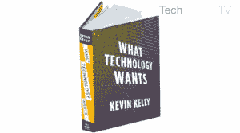

# 热衷于...凯文·凯利:科技想要什么？TechCrunch

> 原文：<https://web.archive.org/web/https://techcrunch.com/2011/01/19/keen-on-kevin-kelly-what-does-technology-want-tctv/>

# 热衷于……凯文·凯利:科技想要什么？(TCTV)

在他的重要新书中，[技术想要什么，](https://web.archive.org/web/20221007035547/http://www.amazon.com/What-Technology-Wants-Kevin-Kelly/dp/0670022152) [凯文·凯利](https://web.archive.org/web/20221007035547/http://www.crunchbase.com/person/kevin-kelly-2)——硅谷的传奇奸细和[连线杂志的](https://web.archive.org/web/20221007035547/http://www.crunchbase.com/company/wired-magazine)资深特立独行者——介绍了技术是一种有需求、想要和欲望的东西。凯利认为的“技术”可能不完全是上帝，但它反映了宇宙的规律，因此是我们作为人类的经验的核心。

对于凯利来说，技术是“我们用大脑制造的东西”——包括从这篇文章到他的书到你的 iPhone 到脸书到互联网的一切。这就是凯利所称的“技术元素”——他的思想似乎同时具有宗教性、达尔文主义和先验性——他说，这就是推动今天看似不可阻挡和不可避免的数字革命的原因。那么这个技术元素从哪里开始，又将在哪里结束？如果有人知道这个问题的答案，那就是凯文·凯利，他在 25 年前，在我们大多数人知道未来存在之前，就预言了未来。

这是我采访 Kelly 的两部分帖子。第一部分可以在这里找到[。](https://web.archive.org/web/20221007035547/https://beta.techcrunch.com/2011/01/18/keen-on-kevin-kelly-what-does-kevin-kelly-want-tctv/)

技术想要什么？

技术的未来是什么？

技术是上帝吗？