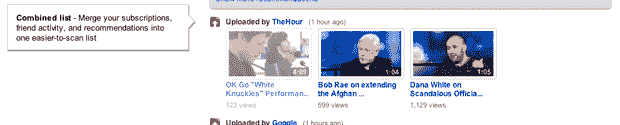
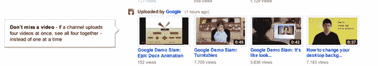
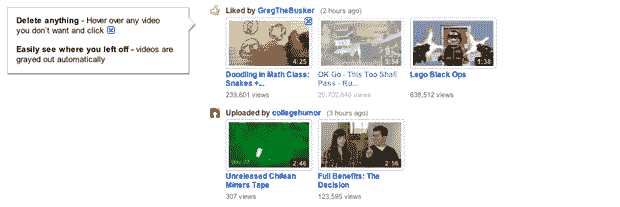
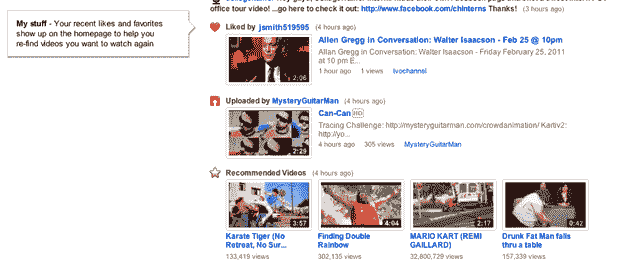
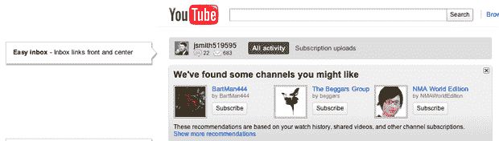

# YouTube 向所有人推出新主页 TechCrunch

> 原文：<https://web.archive.org/web/http://techcrunch.com/2011/01/19/youtube-rolls-out-its-new-homepage-to-everyone/>

# YouTube 向所有人推出了新主页

上个月，YouTube 开始尝试一个新的主页，增加了它的推荐功能，这样它就可以推荐你感兴趣的新内容。今天[向所有用户推出了](https://web.archive.org/web/20230202232441/http://www.youtube.com/homepage_about)实验主页。YouTube 产品经理 Brian Glick 告诉我们，做出这个决定主要是因为用户的积极反馈，*“超过 10 万人填写了一份调查，大多数人认为主页现在更好了。数百万人选择加入，现在我们只是把它展示给所有其他人。”*

这里的主旨似乎是增加网站对登录用户的推荐，他们的解决方案将更多与你互动的视频放在显著位置。Glick 说，*“当你不知道你想看什么的时候，我们试图把主页变成一个目的地。现在，您的个性化内容列表正等着您。”*

YouTube 在[之前的实验](https://web.archive.org/web/20230202232441/http://www.youtube.com/homepage_about)页面上有一个新功能列表，我在下面对它们进行了分解。

**组合列表**

**T13T15
**

**不要错过视频**

**删除任何内容并“灰掉”**

**帮我重新找我刚看过的东西**

**简易收件箱**

YouTube 删除了一些不太受欢迎的非个人化功能，如“正在观看的视频”，并将“聚焦”和“特色视频”部分移到了右侧。这是使主页左侧对用户来说更加个性化的努力的一部分。

格利克说，新功能旨在实现三个不同的个性化维度:“你告诉 YouTube 你喜欢的东西”、“你朋友分享的视频”和“YouTube 认为你喜欢的视频”。新主页专注于提供你朋友喜欢的视频、你订阅的频道以及 YouTube 根据你的喜好推荐的其他内容。这里的关键词是你。

*“这是我们更广泛关注的一部分，即我们如何缩小每天 15 分钟到每天 5 小时的差距”*格利克解释说，他指的是人们通常花 5 小时看电视，而不是花 15 分钟看 YouTube。“我们想让这种个性化的体验跟随你到任何有屏幕的地方。”