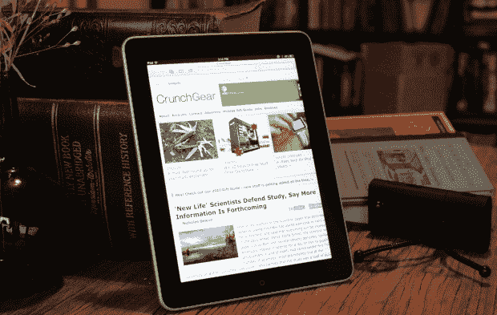

# 苹果公司巨额现金储备中的 39 亿美元将用于液晶显示器？TechCrunch

> 原文：<https://web.archive.org/web/https://techcrunch.com/2011/01/20/3-9-billion-of-apples-massive-cash-reserves-to-go-toward-lcd-displays/>

# 苹果公司巨额现金储备中的 39 亿美元将用于液晶显示器？

当苹果公司周二宣布他们的 [Q1 2011 年数字](https://web.archive.org/web/20221204151154/https://beta.techcrunch.com/2011/01/18/apple-q1-2011/)时，苹果公司的蒂姆·库克发表了一个有趣的评论，关于苹果公司计划如何处理他们庞大的，将近 600 亿美元的现金。苹果将对一些“秘密”组件做同样的事情，这与苹果[买下所有闪存](https://web.archive.org/web/20221204151154/http://www.crunchgear.com/2011/01/20/tsovet-time-watches-are-now-on-sale/)的时候没有什么不同。我们认为我们可能知道秘密是什么，原因如下。

当蒂姆·库克在电话会议上讲话时，他说“我们历史上曾与其他公司达成供应协议；最大的一笔交易是在 2005 年与闪存供应商达成的，交易总额超过 10 亿澳元，因为闪存在整个产品线和行业中变得越来越重要。”正因为如此，苹果成为闪存的最大消费者，当时用于 iPods。库克后来评论说，这项“秘密”交易就像闪电交易一样，它“专注于我们认为非常具有战略意义的领域。”由于竞争优势，库克不愿透露具体内容。那么下一个策略会是什么呢？

在 Q1 的业绩电话会议中，一个有趣的注意事项是，仅仅三个月，苹果就售出了 730 万台 iPad——自 4 月份以来总共售出了 1480 万台——这个数字预计还会增长，尤其是在 iPad 2 发布之后。一些估计已经超过 5000 万。这意味着苹果公司最好锁定供应以满足需求。如果任何关于可能的视网膜显示屏的传言都是真的，那么这种难以生产的屏幕需要准备好。这就是苹果花费 39 亿美元的地方。

2010 年 7 月初，当 LG 努力供应 iPad 屏幕时，LG 首席执行官 Kwon Young-soo 说,“(来自苹果的)需求持续增长，我们无法满足所有需求。由于零部件供应紧张和需求强劲，苹果可能不得不推迟在一些国家推出 iPad。我们正在考虑增加 iPad 产品的生产线，但在明年初之前，整体供应可能会保持紧张。”如果苹果从这件事中学到了什么，那么他们知道为未来的屏幕找到一个以上的供应商是极其重要的。

2010 年 12 月，有两篇报道称，夏普和东芝与苹果一起投资 12 亿美元在中小型液晶显示器上。后来有消息证实，苹果将在 iPhones 上使用这种屏幕。那么那些中型液晶显示器呢？

另一方面，苹果的大供应商鸿海，据说也将投资 12 亿美元在日立的 LCD 业务上，在日本建立一个新工厂。

因此，据报道，所有大屏幕制造商都在生产 LCD 屏幕的新设施上花费了 12 亿美元，并与苹果合作。

在苹果 Q1 财报发布之初，首席财务官皮特·奥本海默表示，39 亿美元已经开始支出，合同从 2010 年 9 月和 12 月开始；如果你注意到这些都是在我们开始听说 LCD 投资的时候发生的。9 月份，就在 LG 表示他们正在努力满足需求之后，12 月份，夏普和东芝的液晶显示器都被选中。

> “在 9 月和 12 月的季度中，我们与三家供应商签订了长期供应协议，通过这些协议，我们预计将在两年内花费总计约 39 亿美元的库存组件预付款和资本支出。我们在 12 月季度根据这些协议支付了大约 6.5 亿美元，预计在 3 月季度支付 10.5 亿美元。”

虽然这没有给我们任何关于屏幕类型的线索，不管是不是视网膜，人们只能想象。