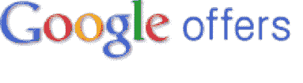

# 这是谷歌的 Groupon 克隆吗？这个标志很合适。[更新:已确认 TechCrunch

> 原文：<https://web.archive.org/web/http://techcrunch.com/2011/01/20/is-this-googles-groupon-clone-well-the-logo-fits/>

# 这是谷歌的 Groupon 克隆吗？这个标志很合适。[更新:已确认]

> Mashable 上的一份报告显示，谷歌将很快推出一款名为谷歌优惠的 Groupon 克隆产品。从他们从一个来源收到的文件来看，这种产品似乎是你的普通克隆产品，*“谷歌优惠是一种日常交易，使订户能够以有吸引力的折扣预购产品和服务。”*哈。

https://www.google.com/images/logos/offers_logo.gif[的网址](https://web.archive.org/web/20230202232148/https://www.google.com/images/logos/offers_logo.gif "http://www.google.com/images/logos/offers_logo.gif/")上的谷歌主办的谷歌优惠标志[增加了另一块拼图。它与下面文档中的相匹配。http://google.com/offers](https://web.archive.org/web/20230202232148/http://www.techmeme.com/110120/p81#a110120p81)[的 404 页面在图形上也不同于 http://google.com/test](https://web.archive.org/web/20230202232148/http://google.com/offers)[和 http://google.com/deals](https://web.archive.org/web/20230202232148/http://google.com/test)的 404 页面，这两个页面都在相似的页面上。

据报道，这家搜索巨头上一次试图进军交易领域时，向 Groupon 提出了 60 亿美元的收购要约。Groupon 没有上钩，看起来正在朝着 150 亿美元估值的 IPO 迈进。

我已经联系了谷歌进行确认，当他们回复时我会更新这个帖子。

**更新:**谷歌在给[搜索引擎 Land 的声明中证实，这确实是他们的 Groupon 克隆版。](https://web.archive.org/web/20230202232148/http://searchengineland.com/google-readies-groupon-clone-report-61930?utm_source=twitterfeed&utm_medium=twitter)

> *“谷歌正在与小企业沟通，争取他们的支持和参与预付费优惠/代金券计划的测试。这一举措是谷歌正在进行的新产品开发工作的一部分，例如最近推出的广告测试版，它以新的方式将企业与客户联系起来。我们目前没有更多的细节可以分享，但会随时通知您。”*

[scribd id = 47286019 key = key-2o 3m 00 yhqexg 512 HL 3 SZ mode = list]