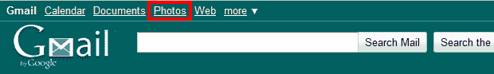
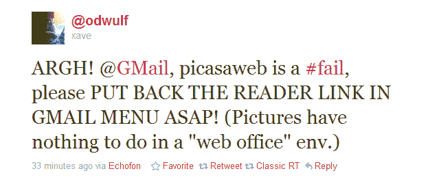
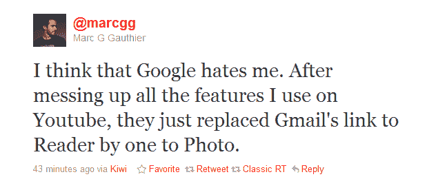
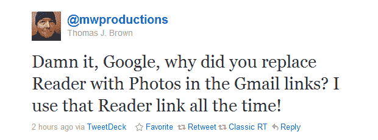
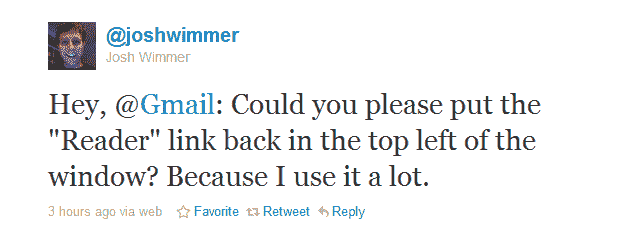
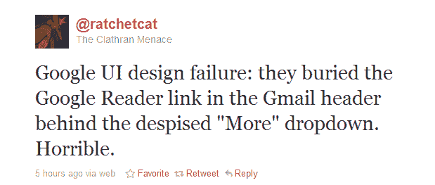

# 谷歌将 Gmail 中的“阅读器”链接替换为“照片”,用户一片慌乱

> 原文：<https://web.archive.org/web/http://techcrunch.com/2011/01/21/google-replaces-reader-link-with-photos-in-gmail-users-in-a-tizzy/?utm_source=feedburner&utm_medium=feed&utm_campaign=Feed%3A+Techcrunch+(TechCrunch>&utm_content=Google+Reader)

# 谷歌将 Gmail 中的“阅读器”链接替换为“照片”,用户一片哗然

更多的证据表明，RSS 正在退出的时代，末日即将来临:[谷歌](https://web.archive.org/web/20230203041842/http://www.crunchbase.com/company/google)似乎已经用 [Gmail](https://web.archive.org/web/20230203041842/http://www.crunchbase.com/product/gmail) 网页界面顶部的“照片”(Picasa)链接取代了其 RSS 阅读器产品[谷歌阅读器](https://web.archive.org/web/20230203041842/http://www.crunchbase.com/product/google-reader)的顶部链接。需要说明的是，链接还在，只是现在藏在了‘More▼’链接后面。

好家伙，自从拉里·佩奇接任首席执行官以来，那个地方真的开始分崩离析了。

当然，这是一个很小的用户界面变化，但这并没有阻止用户在 Twitter 上对此疯狂。

几条精选推文:

另一个用户[提出](https://web.archive.org/web/20230203041842/http://twitter.com/#!/overflowhidden/statuses/28366368969592832):“我在 Gmail 中的谷歌阅读器链接在哪里？！？？！我确信他们可以在分析中看到我每天都在使用它……”

我认为这就是问题所在。你可以在一定程度上定制 Gmail，特别是对于一个免费产品来说，这真的很棒，但你还不能改变顶部菜单项的顺序，这就是让用户愤怒的原因。

也许谷歌会听取这些用户的意见，也许不会。但我认为，如果我们不等着看会发生什么，而是一名 TechCrunch 阅读开发者立即开始编写一个浏览器扩展，将该死的“阅读器”链接放回去，可能会更好。走吧。