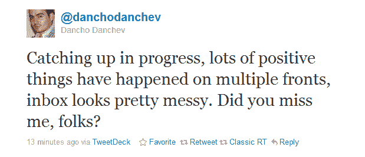

# 好消息:失踪的网络安全专家丹乔·丹切夫不再失踪 TechCrunch

> 原文：<https://web.archive.org/web/https://techcrunch.com/2011/01/21/great-news-missing-cybersecurity-expert-dancho-danchev-is-no-longer-missing/?utm_source=feedburner&utm_medium=feed&utm_campaign=Feed%3A+Techcrunch+(TechCrunch>&utm_content=FriendFeed+Bot)

# 好消息:失踪的网络安全专家丹乔·丹切夫不再失踪

一周前，ZDNet 发表了一篇[令人不安的报道](https://web.archive.org/web/20230203001846/http://www.zdnet.com/blog/security/we-need-help-with-the-strange-disappearance-of-dancho-danchev/7897),内容是关于其博客撰稿人之一，保加利亚本土恶意软件研究员[丹乔·丹切夫](https://web.archive.org/web/20230203001846/http://ddanchev.blogspot.com/)自 2010 年 8 月失踪。他在 ZDNet 上的最后一篇博文出现在 2010 年 8 月 18 日，他的个人博客最后一次更新是在三周后。

ZDNet 称，它曾多次试图与他们联系，但没有结果，并与保加利亚应急小组当局取得了联系，以促使对他的突然失踪进行调查。

好消息是:从他的推特账户最近的活动来看，丹切夫似乎又安全无恙地上线了。从表面上看，他已经和 ZDNet 主编拉里·迪南以及 ZDNet 博客的执行主编大卫·格罗博取得了联系。

丹切夫[发推文](https://web.archive.org/web/20230203001846/http://twitter.com/#!/danchodanchev/status/28458220590735361)说，他将在本周末的博客中总结“发生的一切”，尽管他补充说，由于工作的敏感性，他不能透露所有细节。不管怎样，很高兴你回来了，丹丘。