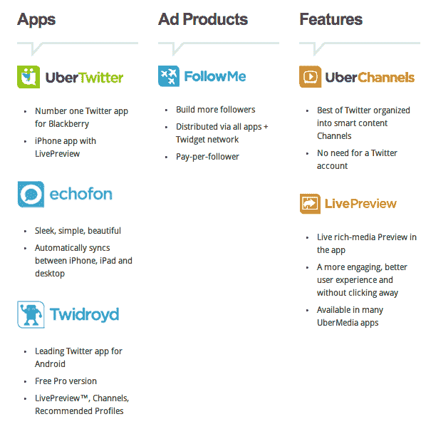

# PostUp 收购了 UberTwitter，并(再次)更名为 Uber media TechCrunch

> 原文：<https://web.archive.org/web/http://techcrunch.com/2011/01/21/postup-acquires-ubertwitter-renames-itself-again-to-ubermedia/?utm_source=feedburner&utm_medium=feed&utm_campaign=Feed%3A+Techcrunch+(TechCrunch>)

# PostUp 收购了 UberTwitter，并(再次)更名为 UberMedia

 [比尔格罗斯](https://web.archive.org/web/20230203014358/http://www.crunchbase.com/person/bill-gross)正在密谋什么。PostUp 的首席执行官，曾创建(并出售)answers.com Overture 和其他一些公司，最近几周刚刚收购了他的第二个 Twitter 客户端。1 月 5 日，PostUp [收购了](https://web.archive.org/web/20230203014358/https://techcrunch.com/2011/01/05/postup-buys-twitter-and-facebook-application-echofon/) EchoFon，今天该公司宣布收购了 UberTwiter，该公司为 iPhone 和黑莓开发 Twitter 客户端。

除了收购之外，PostUp 还有另一条新闻:它将更名为 [UberMedia](https://web.archive.org/web/20230203014358/http://www.ubermedia.com/) 。这是该公司的第三个名字，最初名为 TweetUp，但去年夏天[更名为](https://web.archive.org/web/20230203014358/https://techcrunch.com/2010/08/30/tweetup-now-includes-updates-from-linkedin-and-facebook-changes-name-to-postup/)，因为它增加了对脸书和 LinkedIn 的支持。

那么 UberMedia 在这里的策略是什么呢？该公司现在有一个新的主页，其中包括以下描述:

> UberMedia 是领先的应用程序和基于网络的服务的独立开发商，这些应用程序和服务使用户更容易在 Twitter 和其他社交媒体平台上找到、关注和与他人交流。该公司专注于推动一系列在线和移动平台的用户体验创新。UberMedia 还为广告商和品牌提供了新的方式，通过 Twitter 的应用程序家族与消费者进行互动和交流。

换句话说，它希望提供各种第三方服务，这些服务与 Twitter 提供的服务是互补的，在某些情况下是直接竞争的。

