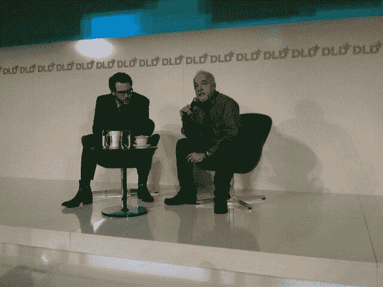

# 肖恩·帕克称《社交网络》是“一部彻头彻尾的小说”

> 原文：<https://web.archive.org/web/https://techcrunch.com/2011/01/23/sean-parker-calls-the-social-network-a-complete-work-of-fiction/>

# 肖恩·帕克称《社交网络》是“一部彻头彻尾的小说”

早期脸书的支持者肖恩·帕克，在 DLD 欧洲会议的舞台上，刚刚对这部社交网络电影做出了可能是他迄今为止最全面的反应，称其为“完全的虚构作品”

在电影的结尾，他的角色，由演员贾斯汀·汀布莱克出演，出现在一个派对上，那里有人吸毒，各种漂亮的模特在周围游荡。

“我真希望我的生活也能这么酷，”帕克说。