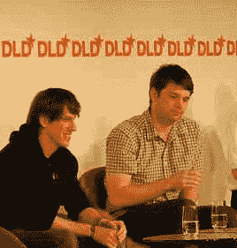

# DLD11: Foursquare 和 Groupon 首席执行官关于破解本地商务难题的演讲 TechCrunch

> 原文：<https://web.archive.org/web/http://techcrunch.com/2011/01/24/dld11-foursquare-and-groupon-ceos-on-cracking-the-local-commerce-nut/?utm_source=feedburner&utm_medium=feed&utm_campaign=Feed%3A+Techcrunch+(TechCrunch>&utm_content=Twitter)

这些是我在德国 [DLD 会议](https://web.archive.org/web/20230202233458/http://www.dld-conference.com/)上关于“本地市场”的小组讨论中的笔记，这次会议邀请了 Groupon 首席执行官[安德鲁·梅森](https://web.archive.org/web/20230202233458/http://www.crunchbase.com/person/andrew-mason)和 Foursquare 首席执行官[丹尼斯·克劳利](https://web.archive.org/web/20230202233458/http://www.crunchbase.com/person/dennis-crowley)。

**问:两个非常激动人心的初创公司站在舞台上。丹尼斯和安德鲁，你们是哪一年开始的？**

丹尼斯:2009 年 3 月。

安德鲁:2008 年 11 月。

**问:在我看来，本地的概念是你们两家公司的核心——也是社会的，但主要是本地的。你能谈谈吗？**

丹尼斯:当我们在 Foursquare 构建产品时，我们会想些什么:我们如何构建让城市更容易使用的东西？我们的软件把人们介绍给其他人，让你发现新的地方，体验新的事物。有一些鼓励人们出去做新东西的游戏，然后我们开始看到当地商人参与进来。

Andrew: Groupon 的前身是 ThePoint.com，一个试图解决同一问题的群体可以聚集在一起在线协调的平台。我们没有真正取得任何进展，接下来就是做当地的日常交易。

**问:你能举些例子说明当时采取了什么样的举措吗？**

安德鲁:早期的东西包括这样的东西:我们想“建立一个当地公园”，“使选举日成为全国性假日”，“让我们让 80 个人一起获得团体折扣”。因此，我们看到了发生在我们平台上的团购努力，并注意到了这一点。

我们基本上是在帮助消费者发现有趣的业务。但与 Foursquare 不同，我不得不说，这在很大程度上是为了钱，为了获得折扣，所以我们比他们更缺乏创新。

**问:总是很难找到当地的商人。在试图解决这个问题时，你如何看待你们公司之间的差异？**

丹尼斯:我们更多的是关于忠诚度，帮助那些想要奖励老顾客的企业，而我认为 Groupon 更多的是关于新顾客的获取。Foursquare 也是用户为其他用户留下提示，这使它更像是一个发现。

**问:Foursquare 是一家社交公司吗？**

丹尼斯:我觉得是社交加地理位置。很多人认为这是关于现在时的，但重要的是，随着时间的推移，你会得到一个伟大的，丰富的用户档案，他们是什么类型的人。

问:Groupon 更像是一种简单的折扣服务？

安德鲁:我们不是打折服务，我甚至不知道“社交商务”是什么意思。本地电子商务听起来与我们的工作更相关。我们将继续沿着这条路走下去，将线下商务带到线上，为当地企业创造一个更高效的市场。

问:为什么你认为你的两家公司都发展得如此之快？

安德鲁:我们打破了本地电子商务的坚冰，这是一个严重的坚冰。在互联网出现之前，对于本地企业来说，甚至没有一种好的获取客户的方式。我的意思是，在电台和当地报纸上做广告是为了提前花钱，购买曝光率，然后祈祷好运。

你没有太多的余地去搞砸并再试一次。有了 Groupon，本地企业可以为重要的事情付费，获得新客户。

**问:好吧，但为什么过去没有发生这种情况？**

安德鲁:这对我们来说也不直观，所以我真的不知道。我们从消费者的角度看待团购这个概念，但我们没有完全意识到这样的事情对城市中的小企业有多么重要。可能十年前就有了，但不会长这么快。

问:你们都享受着快速增长，获得了很多关注。那是什么感觉？以前，创业和曝光需要一些时间，现在这一切都变得更快了。

丹尼斯:我们现在有 50 个人了，所以对我来说这很大，如果你看看躲避球基本上是我们两个人的事实。但我们与商家交谈后发现，我们已经可以雇佣更多的人了。有这么多的曝光，这很好，但我们需要保持专注，并意识到道路仍然很长。

**问:对 Foursquare 最大的误解是什么？**

丹尼斯:公司规模第一。第二，有些人似乎认为 Foursquare 是为纽约和旧金山的潮人准备的。这当然是我们如何开始的，但我们在世界各地都有很多国际用法。这对我们来说是个大惊喜。

问:像 Groupon 这样快速增长的公司面临的最大挑战是什么？

安德鲁:我们的增长可能很快，但它是渐进的。我们从芝加哥开始，花了我们 5 个月的时间才到达第二个城市，然后每次在一个新的城市启动，时间都缩短了。因此，我们花时间开发了原始剧本，并试图在我们的国际扩张中复制这一战略。

通过建立强大的文化基础，雇佣优秀的人才和企业家。所以我们提供剧本，他们执行。

问:foursquare 的文化是什么样的？

丹尼斯:我们有很多乐趣，当我们招聘时，我们试图引进那些不仅是优秀的工程师，而且知道社会如何运作，并对此充满热情的人。在早期，我们雇佣了很多朋友，这很好地融入了我们的文化。

但是我们需要保持谦逊，尽管所有的媒体报道。顺便说一句，曝光率越高就越难。我们有 600 万用户，但我们还有很长的路要走。

问:安德鲁，Groupon 有一种独特的文化。那是从哪里来的？

安德鲁:Groupon 作为一种商业模式有一个令人惊讶的元素，那就是每天都有新的交易。这让我们可以将这种疯狂延伸到业务的其他方面，比如文案。

我担心的是让人们不要因为我们得到的所有信息而过于兴奋。我们必须记住我们只有两岁，路还很长。

还没到庆祝的时候。即使在全体会议上，我们也会花很多时间讨论所有可能出错的事情。

**问:你会用棍子打人吗？**

安德鲁:不再是了。

**问:作为一名企业家，你最担心的是什么？**

安德鲁:我关心的是不要自满，不要满足于现状，继续创新。通常，迅速崛起又迅速失败的公司输给了自己，而不是竞争对手。

我们仍在增长，事情进展得很顺利，所以我认为如果我们专注于让客户满意，我们将继续寻找新的方式来扰乱自己。

问:你们都拒绝了大公司对你们的收购。对此你能说些什么？

丹尼斯:当然，我有玩躲避球的经验，所以我有很好的条件继续把我脑子里的想法转化成产品，并把它们带给人们。我总是这么说，但是我们还没有达到路线图的 10%到 20%,所以现在离开还为时过早。

我们想继续努力。最困难的部分是要对我们的团队有信心。有时候这有点像赌博，尤其是当你比较小的时候。从 5 名到 50 名员工当然不容易。

**问:你曾公开表示，你对自己的第一笔收购有些遗憾。这让你拒绝了 Foursquare 的收购提议吗？**

丹尼斯:嗯，是的，我们也有非常支持我们的投资者，他们希望我们能飞黄腾达。没有太大压力。有人曾经告诉我，当你拒绝了这样一笔交易后，你每天都在想它，这可能是真的，但我对此并不介意。

问:安德鲁，谷歌想收购 Groupon。你能谈谈吗？

安德鲁:你能给我一些如何回避你的问题的选择吗？

问:你到底在想什么？

安德鲁:我不能对任何猜测发表评论，但我可以说本地电子商务是一个令人兴奋的领域。很棒的另类回答，不是吗？

问:是的，你在那里什么也没说。你如何平衡什么对你的团队、你的投资者是正确的，你如何做出决定？

安德鲁:我们非常幸运有伟大的联合创始人和投资者，我们会彻底讨论各种决策。我就说到这里…这不会是一个好的答案。

问:下一步是什么？你是在和银行家谈上市的事吗？

安德鲁:是的，我们是。我们在学习，因为我们不知道该做什么。这是事实。我们还没有做出决定。

**问:和银行家交谈是什么感觉？**

安德鲁:就像和投资者交谈一样。差不多吧。

**问:首次公开募股对你来说是正确的吗？**

安德鲁:这似乎是一件合理的事情。首次公开募股对商界来说很有吸引力，但我认为这只是我们前进方向上的又一步。我在考虑长期的。

问:丹尼斯，Foursquare 要去哪里？

丹尼斯:有趣的是，很多人在 Foursquare 上看到的是签到游戏。我们开始是那样的，但是我们想要证明我们现在不仅仅是那样。我们从用户那里获得了有趣的数据，我们正在想办法将这些数据回收给这些用户，让他们的生活更丰富、更有趣。

**问:使用 Foursquare 作为基础平台的第三方应用怎么样？**

丹尼斯:在我们开发的产品之外，我们有一个平台，开发者可以用它在我们的基础设施上创造东西。我们看到成千上万的开发者正在开发许多不同的东西，从评论服务到约会服务。

安德鲁:我能打断一下吗？我想说为什么我不热衷于回答你之前的问题。我不想成为公司的混球，这是我想避免的。但是让我解释一下我为什么回避这些问题。

当我们第一次收购一家公司时，我们不知道会发生什么。这是一个非常私人的过程，你们正在互相了解，非常亲密，然后突然每个人都希望我们在公开场合这样做，而我们仍然在搞清楚事情。

问:所以你这样做是出于尊重？没有得了便宜还卖乖？

安德鲁:(叹气)是啊。

问:你希望 Groupon 变成什么样？

安德鲁:我们希望成为本地电子商务领域的亚马逊或易贝。我们希望成为人们在谈话中提到该业务时会想到的东西。对于一家公司来说，将线下商务带到线上是一个巨大的机会，而我们已经做好了这样做的准备。

*图片来源:FLickr/ [弗洛里安·克拉考](https://web.archive.org/web/20230202233458/http://www.flickr.com/photos/dotdean/5384158935/in/photostream/)*