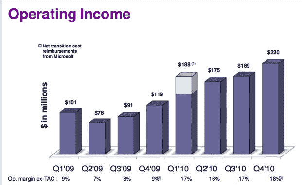

# 巴茨谈脸书:他们有更多的“小印象”，我们有更多的“展示收入”

> 原文：<https://web.archive.org/web/http://techcrunch.com/2011/01/25/bartz-facebook-q4/>

# 巴茨谈脸书:他们有更多的“小印象”，我们有更多的“展示收入”

在今天雅虎第四季度收益电话会议的末尾，首席执行官卡罗尔·巴茨被问及与脸书在展示广告方面的竞争。不知从哪里冒出来的脸书占据了互联网上所有展示广告的近四分之一。

“对于脸书是否在展示广告领域处于领先地位，人们还有些困惑，”巴茨回应道。“这是因为他们有很多小印象。我们实际上在展示收入方面领先。”但实际上，两者可能并驾齐驱。2010 年，雅虎报告的展示广告收入(扣除流量获取成本，即他们给合作伙伴网站运营其广告的部分)为 18.9 亿美元。与此同时，脸书[预计 2010 年全球广告收入](https://web.archive.org/web/20230203021139/https://techcrunch.com/2011/01/18/emarketer-global-ad-spending-on-facebook-will-reach-4b-by-years-end/)为 18.6 亿美元，预计今年的广告收入将增长一倍以上，达到 40 亿美元。

对这种比较要有所保留，因为一个是真实的审计数据，另一个是对私人公司业务的估计，但如果这一估计接近正确，脸书将很快在展示广告收入和展示次数方面超过雅虎，如果它还没有这样做的话。

雅虎在第四季度显示出其底线的显著改善，利润翻了一番，达到 3.12 亿美元。然而，其 12 亿美元的收入(再次减去 TAC)下降了 4%。为了抵御脸书，雅虎必须让总体收入再次增长，而且要快。

雅虎通过削减成本来增加利润(正如它今天通过更多的裁员来增加利润),而不是通过增加业务来增加利润。尽管如果你分解雅虎的收入，显示广告是一个亮点。该季度收入增长 16%，至 5.67 亿美元，而搜索收入下降 18%，至 3.88 亿美元。(参见下面的收益幻灯片)。

对于雅虎是什么这个问题，巴茨似乎也有更好的答案。她似乎已经决定让雅虎成为一家“伟大的内容”公司。换句话说，一家媒体公司。“我们只是想创造人们感兴趣的内容，”她说。我们不都是吗？

[scribd id = 47564026 key = key-27 MC 78 aw 7 CRM 7 ij 6 di0w mode = slide show]