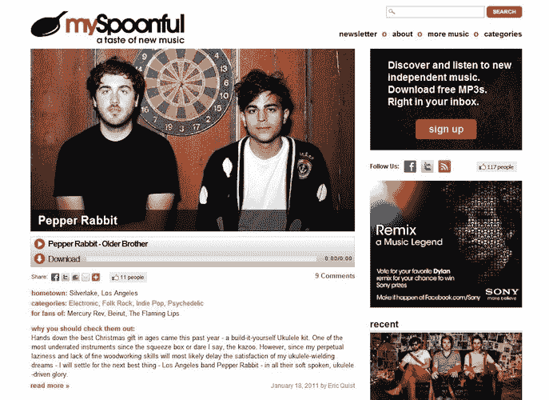

# mySpoonful 就像是独立音乐 TechCrunch 的每日卡通

> 原文：<https://web.archive.org/web/http://techcrunch.com/2011/01/25/myspoonful-is-like-a-dailycandy-for-indie-music/>

# mySpoonful 就像是独立音乐的每日卡通

[mySpoonful](https://web.archive.org/web/20230205004053/http://www.myspoonful.com/) 是一个策划网站和电子邮件时事通讯，面向那些太忙而没有时间花时间在更广泛的网站上跋涉的独立音乐爱好者，如 [Pitchfork](https://web.archive.org/web/20230205004053/http://www.pitchfork.com/) 和 [Stereogum](https://web.archive.org/web/20230205004053/http://www.stereogum.com/) 。Pageflakes 创始人兼前首席执行官丹·科恩说，*“孩子们必须阅读许多报纸和博客，以跟上酷孩子的步伐……*我阅读 Pitchfork 和 Sterogum 以及许多其他网站，希望深入阅读这些伟大的网站，但如果你每天只有时间阅读一封电子邮件，那么我们就是其中之一。”**

mySpoonful 团队(包括科恩、斯泰西·霍恩(Stacey Horne)和阿莫斯·施瓦茨法布(Amos Schwartzfarb ))只提供“一勺”不拘一格的音乐内容，他们选择一位新的艺术家，每周三次提供免费歌曲下载，发布到网站上，并在周二、周三和周五发送简讯。*“我们就像独立唱片店员工的网络版，总是知道该听什么新乐队，”*科恩说。

目前，该网站面向全国，但科恩希望他们很快会推出本地版本，涵盖奥斯汀或旧金山等特定音乐场景。最终，他想向他们的订户群 la DailyCandy 和 Thrillist 提供交易，销售乐队商品和音乐。

mySpoonful 目前正在引导。科恩计划在网站和电子邮件简讯上做广告，这份简讯已经有 25000 名前生的订阅者。

科恩说，在与休闲音乐势利者相同的空间里，仍有一个市场有待开发，“我们的目标是不同的受众，很多人都很忙，有工作，有家庭，但仍以说‘我听说过胡椒兔或最佳海岸’为荣。””