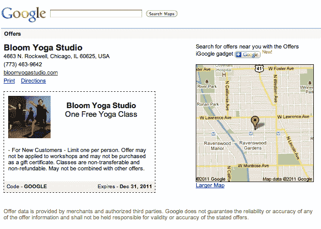
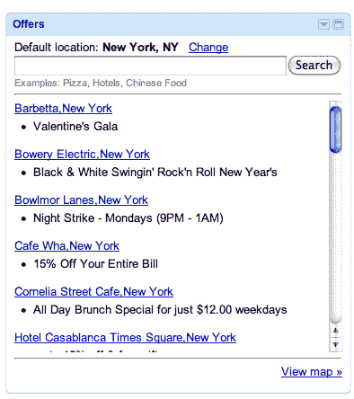
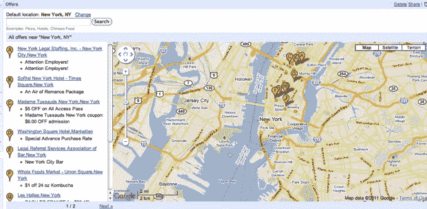
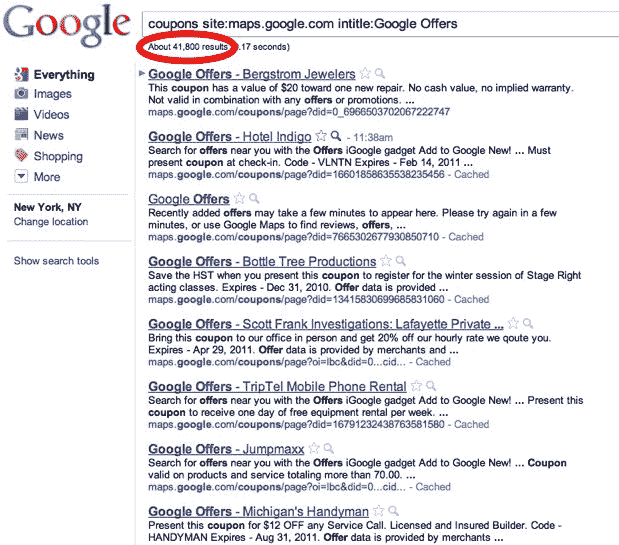

# 先睹为快谷歌优惠(谷歌搜索提供)TechCrunch

> 原文：<https://web.archive.org/web/http://techcrunch.com/2011/01/25/sneak-peak-google-offers/?utm_source=feedburner&utm_medium=feed&utm_campaign=Feed%3A+Techcrunch+(TechCrunch>)

谷歌以 60 亿美元收购 Groupon [的交易没有成功](https://web.archive.org/web/20230202234615/https://techcrunch.com/2010/12/03/confirmed-the-groupongoogle-deal-is-off/)，但它没有浪费时间准备自己的竞争对手谷歌提供的本地广告产品。谷歌出价的第一个[暗示于上周出现。谷歌证实了这一消息，称其为“预付费优惠/代金券计划的测试”，但没有提供更多细节。](https://web.archive.org/web/20230202234615/https://techcrunch.com/2011/01/20/is-this-googles-groupon-clone-well-the-logo-fits/)

嗯，我们有进一步的细节，感谢谷歌自己的搜索引擎。(公关失败的时候，谷歌一下就好了)。有一个非常简单的方法来获得一个活跃的谷歌优惠券列表。这是一种后门，但如果你在[搜索](https://web.archive.org/web/20230202234615/http://www.google.com/search?sourceid=chrome&ie=UTF-8&q=coupons+site:maps.google.com+intitle:Google+Offers)优惠券网站:maps . Google . com intitle:Google Offers，你可以看到近 42，000 个结果，其中大部分链接到个人活动优惠券。例如，这里有一张在芝加哥(Groupon 的主场)的免费瑜伽课的门票，或者另一张在马萨诸塞州沃特敦的一家素食餐馆午餐半价的门票。您还可以在 iGoogle 主页上添加一个[优惠小工具](https://web.archive.org/web/20230202234615/http://www.google.com/ig/adde?source=atgs&moduleurl=www.gstatic.com/ig/modules/coupons/coupons.xml)，显示您附近的优惠。

谷歌最近刚刚开始向小企业推广这项服务，已经有大约 42，000 个报价(假设每个结果都是唯一的报价)。也许谷歌正在等待 10 万或 50 万的报价，然后再公开推出这项服务，但当地的商家已经开始成群结队地签约了。如果你去一个活跃的优惠券页面，你会看到实际报价上面的企业名称和地址，在一条虚线框内。我猜你应该把手机上的优惠券给收银员看，或者你应该把它打印出来并剪下来。盒子里有优惠详情，还有优惠券代码和截止日期。优惠券旁边是一张小地图，显示商家的位置。iGoogle 小工具显示谷歌提供的东西可能看起来像一个 Android 应用程序，向你显示附近的优惠。

虽然它被称为 Groupon 的克隆，但谷歌优惠似乎不是一种团购折扣服务。谷歌不会出售这些交易，也不会直接向消费者收钱。相反，谷歌提供的是一种直接、自助的本地广告服务。这些交易包括在曼哈顿联合广场的全食超市购买 1 美元的康普茶，或者在密西根的 T2 购买 10 美元的臭水沟清洁服务。与 Groupon 不同，它们不要求最低购买人数才能生效，也不像 Groupon 那样有趣或古怪。

它们也不会为这些业务带来大量新客户(这些交易看起来平淡无奇，而非疯狂)。这是一种完全不同的商业模式。Groupon 说服商家提供惊人的交易，特别是因为它的一天一笔交易的促销活动和新客户激增的承诺。谷歌优惠似乎更倾向于向你展示你附近的交易，而且很可能更依赖于你的手机和谷歌地图。这种方式可能比 Groupon 的规模更大，但交易的质量可能没有那么令人兴奋。显然，由于这是一项正在进行的工作，我们将不得不等待，看看谷歌提供的其他功能实际上会推出什么。

**更新**:正如一些评论者指出的，这些谷歌优惠看起来非常类似于[谷歌优惠券](https://web.archive.org/web/20230202234615/http://www.google.com/support/places/bin/answer.py?hl=en&answer=142916&rd=1#coupons)，这是当地企业长期以来作为谷歌地点的[功能而获得的。这可能是在更广泛的谷歌产品发布会之前对该功能的重新命名。iGoogle 小工具也是新的。](https://web.archive.org/web/20230202234615/https://techcrunch.com/2010/04/20/google-places/)

更新 2:我已经能够确认这些谷歌优惠确实是以前所谓的谷歌优惠券。虽然谷歌在它的支持页面上仍然称它们为“优惠券”,但是这个名字最近已经改变了。更令人困惑的是，谷歌正准备推出一种预付费优惠产品，也称为谷歌优惠，它更像 Groupon，因为交易必须提前支付才能兑现。两者都将是同一个产品家族的一部分，但谷歌可能会找到区分两者的方法。

(向[史蒂夫·圣日耳曼](https://web.archive.org/web/20230202234615/http://freespeechsoldhere.com/)致敬)

