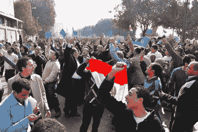
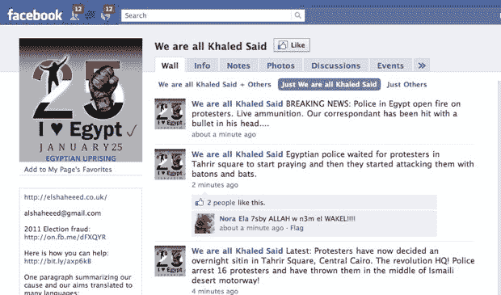

# 抗议不断升级，推特在埃及被封

> 原文：<https://web.archive.org/web/https://techcrunch.com/2011/01/25/twitter-blocked-egypt/>

受最近突尼斯反腐败示威活动的鼓舞，抗议者们挤满了开罗的街道。和突尼斯的[抗议一样，埃及的抗议也部分是在脸书和推特上组织的。根据我们收到的各种推文和提示，现在 Twitter 似乎在埃及被屏蔽了。然而，到目前为止只有 Twitter 网站本身被屏蔽(包括移动网站)，但开罗的人们仍在使用 Twitter 第三方客户端继续发布推文。也有报道称，整个移动网络都被移动运营商屏蔽了，但至少有一家运营商，沃达丰埃及公司](https://web.archive.org/web/20230405152407/https://techcrunch.com/2011/01/14/tunisia/)[否认屏蔽了 Twitter，而是将问题归咎于过载的网络。更新:一名密报者称推特应用也被屏蔽了，唯一发推特的方式是使用网络代理。**更新 2** :被要求确认 Twitter 在埃及被屏蔽，谷歌公关](https://web.archive.org/web/20230405152407/http://twitter.com/#!/VodafoneEgypt/status/29927017323433984)[将](https://web.archive.org/web/20230405152407/http://twitter.com/#!/twitterglobalpr/status/29936527811289089)指向这份 [Herdict 报告](https://web.archive.org/web/20230405152407/http://www.herdict.org/web/explore/detail/id/EG/2633/1)，这表明它在该国实际上是无法访问的。

脸书也被用来组织示威活动，世界各地也出现了记录起义并给予支持的团体。例如，脸书一个名为 [We Are All Khaled Said](https://web.archive.org/web/20230405152407/http://www.facebook.com/elshaheeed.co.uk?v=wall) 的组织，以抗议活动的最新消息和现场照片为特色。Khaled Said 是“一个在亚历山大被警察残酷折磨并杀害的年轻人”，Blake Hounshell 在*外交政策* [博客](https://web.archive.org/web/20230405152407/http://blog.foreignpolicy.com/posts/2011/01/25/swarm_tactics_befuddle_police_in_cairo)上解释道，他的死已经成为“警察日”示威活动的一个集结地，这是埃及的一个全国性节日。

**更新**:脸书集团[报告](https://web.archive.org/web/20230405152407/http://www.facebook.com/elshaheeed.co.uk/posts/191017984258795)警方用[橡皮子弹](https://web.archive.org/web/20230405152407/http://www.facebook.com/elshaheeed.co.uk/posts/187035964651497)向抗议者开火。

社交媒体在组织和传播世界各地反对政府的抗议活动中发挥着越来越重要的作用。与电视或报纸不同，推特和脸书不太容易控制，除非完全屏蔽它们，因为它们的分布式本质。当一个政权意识到它唯一的选择是屏蔽 Twitter 这样的服务时，抗议活动通常已经开始了。无论如何，报道不断通过这些渠道出现，这使得它们成为观察抗议(有时是随后的起义)展开的最直接的方式。这些报告可能并不总是马上准确(例如，将橡皮子弹与“实弹”混淆，但它们往往会很快自我纠正。

**更新** : [推特证实他们在埃及被屏蔽](https://web.archive.org/web/20230405152407/https://techcrunch.com/2011/01/25/twitter-blocked-in-egypt/ "Twitter Confirms That They’re Being Blocked In Egypt")

*照片经由[脸书](https://web.archive.org/web/20230405152407/http://www.facebook.com/photo.php?fbid=179181195454206&set=a.134576649914661.12242.133634216675571&pid=369000&id=133634216675571)*

http://twitter.com/#!/IRC president/status/29916644545396736

http://twitter.com/#!/NasmaBar/status/29921235479568384

http://twitter.com/#!/mideast youth/status/29920901017370624

http://twitter.com/#!/沃达丰埃及/状态/29927017323433984

