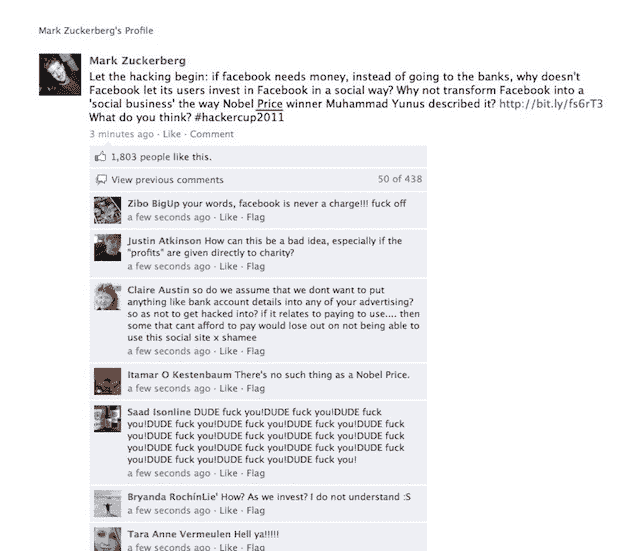
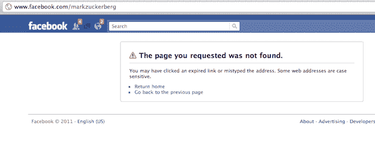

# “让黑客攻击开始吧”攻击扎克伯格脸书粉丝页面 TechCrunch 的人宣称

> 原文：<https://web.archive.org/web/https://techcrunch.com/2011/01/25/zuckerberg-fan-page-hack/?utm_source=feedburner&utm_medium=feed&utm_campaign=Feed%3A+Techcrunch+%28TechCrunch%29&utm_content=Google+Reader>

# “让黑客攻击开始吧”攻击扎克伯格脸书粉丝页面的人宣称

今天早些时候，脸书首席执行官马克·扎克伯格的粉丝页面上出现了一条奇怪的消息。其内容如下:

> 让黑客攻击开始吧:如果 facebook 需要钱，与其去找银行，为什么脸书不让它的用户以社交方式投资脸书呢？为什么不像诺贝尔经济学奖得主穆罕默德·尤努斯描述的那样，将脸书转变成一个“社会企业”？http://bit.ly/fs6rT3，你觉得怎么样？#hackercup2011

谁写了这样一个奇怪的，看起来像喝醉了的消息？好吧，如果你相信这个页面，扎克伯格自己也相信。帖子发布后不久，就有超过 1800 个赞和近 500 条评论。

显然，扎克伯格实际上并没有写。或者至少，我们很确定他没有。相反，他的粉丝页面似乎被黑了。脸书现在已经撤下了这个页面——但在此之前我们抓取了一个截图。

我们已经联系了他们，询问到底发生了什么。我们收到回复后会更新。

