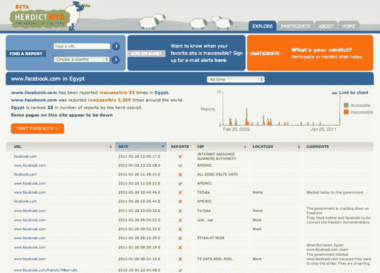
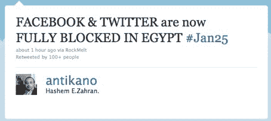

# 据报道，封锁 Twitter 后，埃及开始限制访问脸书 TechCrunch

> 原文：<https://web.archive.org/web/https://techcrunch.com/2011/01/26/after-blocking-twitter-egypt-reportedly-starts-restricting-access-to-facebook/>

# 据报道，封锁推特后，埃及开始限制访问脸书

根据我们在过去几分钟收到的一些[消息](https://web.archive.org/web/20230221011111/http://twitter.com/antikano/status/30248713507045376)、推特上的[聊天以及一些当地报道(大部分是阿拉伯语)，看起来埃及当局已经开始封锁](https://web.archive.org/web/20230221011111/http://search.twitter.com/search?q=egypt+blocked+facebook)[脸书](https://web.archive.org/web/20230221011111/http://www.crunchbase.com/company/facebook)。

受最近突尼斯反腐败示威活动的鼓舞，抗议者走上开罗街头，抗议政府腐败和政策。

与突尼斯的抗议活动类似，埃及的示威活动部分是在脸书和推特上组织的。昨天，[推特在埃及被封](https://web.archive.org/web/20230221011111/https://techcrunch.com/2011/01/25/twitter-blocked-egypt/)。

如果脸书事实上已经被封锁，这并不奇怪。脸书本身也被积极利用来组织埃及的示威游行。例如，脸书一个名为 [We Are All Khaled Said](https://web.archive.org/web/20230221011111/http://www.facebook.com/elshaheeed.co.uk?v=wall) 的组织，以抗议活动的最新消息和现场照片为特色。哈立德·赛义德是“一个在亚历山大被警察残酷折磨并杀害的年轻人”，布莱克·洪谢尔在*外交政策* [博客](https://web.archive.org/web/20230221011111/http://blog.foreignpolicy.com/posts/2011/01/25/swarm_tactics_befuddle_police_in_cairo)上解释说，他的死已经成为“警察日”示威活动的一个集结地，这是埃及的一个全国性节日。许多在推特上被屏蔽的人现在求助于脸书进行活动。

我们已经联系了脸书，以确认该社交网络是否已被屏蔽，当我们收到回复时将会更新。

**更新:**脸书已发出此回应:

> 我们知道服务中断的报道，但没有看到来自埃及的交通有任何重大变化。你可能想访问哈佛大学伯克曼互联网中心&协会的项目[Herdict.org](https://web.archive.org/web/20230221011111/http://www.herdict.org/web/explore/detail/id/EG/2245/32767)，该项目提供了对世界各地用户在网络可访问性方面所经历的洞察。

但 Herdict 页面显示，从该国越来越难以进入脸书。

