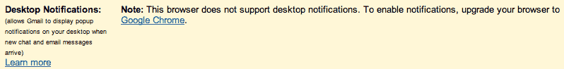

# 浏览器驱动的桌面通知即将登陆 Gmail TechCrunch

> 原文：<https://web.archive.org/web/https://techcrunch.com/2011/01/26/browser-powered-desktop-notifications-are-coming-to-gmail/>

# 浏览器驱动的桌面通知即将登陆 Gmail

这很好。如果你是一个重度 Gmail 用户，你可能已经安装了某种桌面通知系统——可以是一个浏览器扩展，一个单独的 Gmail 应用程序，如 Mailplane 和/或 Growl。但是现在，紧接着在浏览器标签中推出动态未读计数之后，Gmail 推出了不需要任何下载的东西:内置桌面通知。

Gmail 上的一个小横幅刚刚提示我启用了这项功能，它对向内的聊天和电子邮件都有效(你可以选择接收所有新邮件的通知，或者只接收你的优先收件箱认为“重要”的邮件)。谷歌可能正在逐步推出这一功能(目前还没有博客帖子)，但我在我的两个账户中都看到了这一功能。

该功能的“帮助”页面是空白的(尽管横幅链接到它)，所以细节仍然很少。这大概是使用 HTML5 浏览器通知，并且显然只在 Chrome 上工作——我试图在 Safari 上测试它，并收到以下消息:

在实践中，它似乎工作得相当好，虽然我想我现在会坚持用咆哮。我注意到通知没有出现在屏幕上的最短时间——如果我的一个朋友连续发送多条即时消息，最新的会立即出现在旧的上面。更糟糕的是，看起来通知没有超时——一个朋友刚刚给我发了 im，她的通知已经在我屏幕的角落里挂了整整一分钟了。