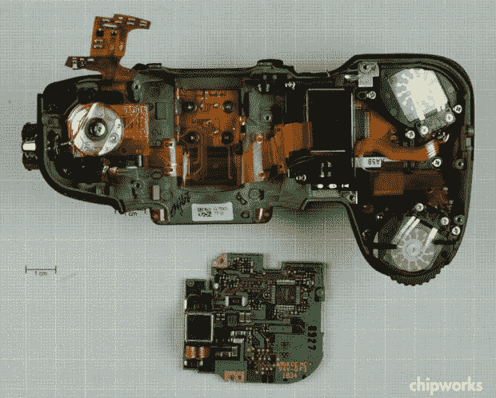

# 尼康 D7000 的拆卸展示了现代 DSLR 包装良好的内部

> 原文：<https://web.archive.org/web/https://techcrunch.com/2011/01/26/teardown-of-nikon-d7000-shows-off-the-well-packed-interior-of-a-modern-dslr/>

# 尼康 D7000 的拆卸展示了现代 DSLR 包装良好的内部

 
我不会说这次拆卸一台 [D7000](https://web.archive.org/web/20221231063700/http://www.crunchgear.com/2010/09/15/nikons-new-d7000-focuses-on-the-enthusiast-market/) 比一台[佳能](https://web.archive.org/web/20221231063700/http://www.crunchgear.com/tag/canon/)或[宾得](https://web.archive.org/web/20221231063700/http://www.crunchgear.com/tag/pentax/)更令人感兴趣，但你不会经常看到全新的数码单反[像这样裂开](https://web.archive.org/web/20221231063700/http://www.chipworks.com/en/technical-competitive-analysis/resources/recent-teardowns/2011/01/teardown-of-the-nikon-d7000-dslr/)。当你仔细想想，这些家伙真的有相当多的计算能力。能够以每秒 5 或 6 张的速度处理和写入 30 张 1600 万像素的 RAW 或 JPEG 图像是一项艰巨的任务。去吧，现在就在你最喜欢的图像编辑器中打开 30。像闪电一样，对吗？不，没有那么多。

大主板看起来有足够的空间，实际上…空间用于并行图像处理器或额外的高速缓存，这两者都可能很好。我很惊讶 DSLRs 上没有更多的内部存储，用于临时保存队列中要处理或写入的文件。

其余的拆解(以及一些更突出的部件和芯片的技术分析)[可以在 Chipworks](https://web.archive.org/web/20221231063700/http://www.chipworks.com/en/technical-competitive-analysis/resources/recent-teardowns/2011/01/teardown-of-the-nikon-d7000-dslr/) 这里找到。