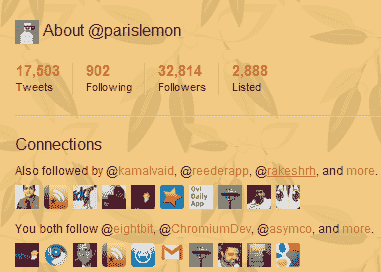

# Twitter 推出“连接”，它是脸书的“共同的朋友”TechCrunch 的翻版

> 原文：<https://web.archive.org/web/http://techcrunch.com/2011/01/26/twitter-launches-connections-its-own-version-of-facebooks-mutual-friends/>

# Twitter 推出了“连接”，它是脸书“共同的朋友”的翻版

 Twitter 已经将其[、](https://web.archive.org/web/20230203005916/https://techcrunch.com/2010/08/16/twitters-followed-by-and-you-both-follow-more-useful-than-mutual-friends/)和[“你们都关注”](https://web.archive.org/web/20230203005916/https://techcrunch.com/2010/06/02/twitter-testing-friends-in-common-feature/)功能合并到一个名为“联系”的区域，让你可以看到你和其他 Twitter 用户有哪些共同之处。虽然您仍然看不到你们共有的用户数量，但单个功能现在是可扩展的，当您点按“更多”时，您可以看到任何给定用户的共同关注者和您共同关注的人的完整列表

尽管他们之前已经试验过这个功能，但这一改变是朝着开发一个更有用的 Twitter 社交图迈出的永久性一步。Twitter 的 Carolyn Penner 说*“通过公开你和另一个用户共有的账户，你现在会知道这些账户是如何与你已经关注的其他账户联系在一起的。因此，您将能够就关注哪些客户做出更明智的决定。”*

脸书和 Foursquare 拥有“共同好友”社交图功能已经有一段时间了，但 Twitter 花了一些时间来解决这个问题，因为“朋友”与“关注者”(更不用说“被关注者”)的概念更难应用于微博网络。

尽管 Twitter 的无限可能单向连接链有时难以理解，但它们给了该公司[余地](https://web.archive.org/web/20230203005916/https://techcrunch.com/2010/05/13/twitter-facebook/)来推出更多基于这一复杂社交图的功能。Twitter 目前没有新的“联系”功能的计划。

感谢: [Vikas SN](https://web.archive.org/web/20230203005916/http://tsuvik.posterous.com/twitter-launching-a-new-twitter-connections-f)