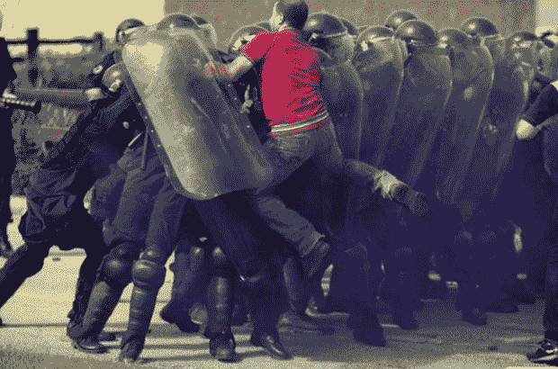

# 埃及局势变得更糟，人们报告互联网和短信关闭

> 原文：<https://web.archive.org/web/https://techcrunch.com/2011/01/27/egypt-situation-gets-worse-people-reporting-internet-and-sms-shutdown/>

# 埃及局势变得更糟，人们报告互联网和短信关闭

当[报道](https://web.archive.org/web/20230405151736/http://www.readwriteweb.com/archives/complete_internet_blackout_in_egypt.php)继续涌入埃及抗议活动，政府在明天计划的示威游行之前先发制人，切断国家的互联网连接，以及对脸书、推特和黑莓等社交媒体服务的访问时，全世界都在震惊地看着。

除了阿拉伯记者和 CNN 的本·魏德曼，路透社现在报道开罗的用户正在经历电话和网络关闭。*“埃及关闭了互联网，”* [一个标题这样写道。](https://web.archive.org/web/20230405151736/http://www.arabist.net/blog/2011/1/28/urgent-egypt-has-shut-off-the-internet.html)

路透社也报道说，埃及总理办公室否认脸书和推特已经被关闭，尽管无数的说法相反。

http://twitter.com/#!/戈登雷诺兹/状态/30779944099389440

美联社发布了一段令人毛骨悚然的埃及抗议者被枪杀的视频后不久，推特和其他地方就出现了大量的通讯中断报道。一名在开罗有亲戚的消息人士称，他正通过座机与他们联系，他们证实了[的报道](https://web.archive.org/web/20230405151736/http://twitter.com/#!/Alshaheeed/status/30784655653347329)防暴警察正在放火焚烧汽车。*“你此刻不能在埃及发短信，*”他说。

无论是国内还是国外，没有人确切地了解停电发生的原因和方式，或者它将如何结束，但人们相信，这些努力是一个有 30 年历史的政权试图镇压一个由社交媒体和精通技术的年轻人组成的抗议组织。

TC 的 Mike Butcher [指出](https://web.archive.org/web/20230405151736/http://eu.beta.techcrunch.com/2011/01/28/is-vodafone-colluding-with-the-egyptian-regime/)，埃及的主要服务提供商是 TEDATA、Egynet DSL 和沃达丰。自从 1 月 25 日沃达丰否认封杀推特以来，它一直保持沉默。

自然，你可以在推特上关注[# 1 月 25 日](https://web.archive.org/web/20230405151736/http://search.twitter.com/search?max_id=30789329970274304&offset_recent_correction=3&page=2&q=%23jan25&rpp=20)和[#埃及](https://web.archive.org/web/20230405151736/http://www.twitter.com/Egypt)的动态。天使投资人 Shervin Pishevar 也设想了一个开放的网状路由器网络，在政府试图切断通信的情况下可以作为备用。皮舍瓦正在寻找志愿者，有兴趣的人可以发微博到@舍温。

图片:[艾哈迈德·肖凯尔](https://web.archive.org/web/20230405151736/http://twitpic.com/3tmlos)