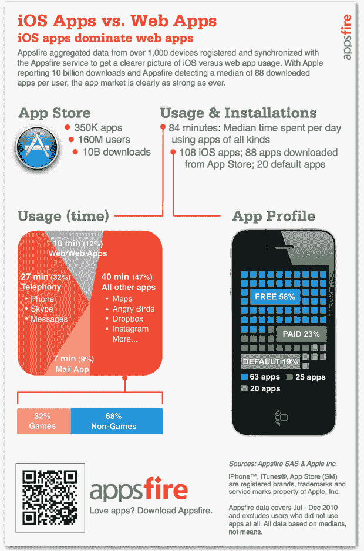

# 在 iOS 设备上，本地应用胜过网络应用(信息图)

> 原文：<https://web.archive.org/web/https://techcrunch.com/2011/01/27/on-ios-devices-native-apps-trump-web-apps-infographic/>

# 在 iOS 设备上，原生应用胜过网络应用(信息图)

[Appsfire](https://web.archive.org/web/20221224192523/http://www.crunchbase.com/company/appsfire) ，领先的[移动应用发现](https://web.archive.org/web/20221224192523/http://appsfire.com/)平台之一，[分析了来自其用户的 1000 台设备](https://web.archive.org/web/20221224192523/http://blog.appsfire.com/infographic-ios-apps-vs-web-apps)，以获得关于本地应用与网络应用之争的一些见解。现在是 2011 年，所以这项研究当然伴随着一张信息图。

你可以在下面找到的信息图，是相当不言自明的。

虽然通过手机访问的网络应用每天都变得越来越强大，但本地应用似乎仍占主导地位。

根据 Appsfire 的数据，iOS 设备的所有者通常只花 10%的时间在移动浏览器上，包括网络应用。这与 50%的时间花在原生应用上的数字形成鲜明对比，这还不包括默认的邮件应用和其他典型的电话应用(大多数是预装应用，但也包括 Skype)。

其研究的其他结果:

–iOS 用户中值会主动安装 88 个应用程序(即不包括预装应用程序)
–设备上 23%的应用程序是付费应用程序
–花在原生应用程序(不包括电话或邮件)上的 32%时间用于游戏

另见:[每台 iOS 设备下载了超过 60 个应用](https://web.archive.org/web/20221224192523/https://techcrunch.com/2011/01/16/asmyco-each-ios-device-has-downloaded-more-than-60-apps/)

