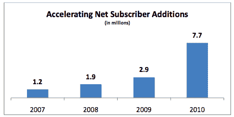

# 流媒体正在推动网飞 TechCrunch 新用户的增长

> 原文：<https://web.archive.org/web/http://techcrunch.com/2011/01/27/streaming-subscriber-growth-netflix/?utm_source=feedburner&utm_medium=feed&utm_campaign=Feed%3A+Techcrunch+(TechCrunch>)

# 流媒体正在推动网飞新用户的增长

网飞正把未来的业务押在互联网上的流媒体电影和电视节目上，到目前为止，这一赌注正获得丰厚的回报。就在去年 11 月，它推出了每月 7.99 美元的[纯流媒体订阅](https://web.archive.org/web/20230202234835/http://www.crunchgear.com/2010/11/22/netflix-intros-7-99-streaming-only-plan-while-slightly-increasing-the-unlimited-dvd-plan/)，这有助于推动上个季度的用户增长 63%，到年底拥有 2000 万用户。“超过三分之一的新用户签署了纯流媒体计划，”网飞在给股东的一封信中报道。该公司预计这一比例将继续增长。

网飞去年净增 770 万新用户，高于 2009 年的 290 万。流媒体日益增长的吸引力应该会继续推动这一数字上升。网飞正在减少支出以吸引新顾客。虽然新用户增长了 63 %,但网飞在营销上的花费却减少了 10%。该公司在本季度获得新用户的平均成本从 9 月份的 19.81 美元下降到了 11.13 美元。此外，越来越多的人正在利用网飞的一个月免费试用，看看流媒体是否适合他们。近 9%的用户在本季度进行了免费试用，高于上一季度的 6%(一年前为 3%)。

网飞还谈到了一些媒体公司对流媒体将与有线电视竞争的担忧。但它提供了一个内容合作伙伴 Starz 的例子，以表明流媒体不一定要蚕食其他收入来源。它还指责 HBO 没有向网飞授权其节目。在信中，网飞指出:

> 一些内容所有者担心授权给网飞会削弱其他更大的利润流。Starz 的例子表明情况并非如此。我们从 2008 年 10 月开始播放 Starz，我们没有授权 HBO。在这段时间里，Starz 的多频道视频节目分销商(MVPD)的用户数量增加了，而 HBO 却没有。在更细的层面上，Starz 原创的《斯巴达克斯》在网飞和 MVPD 同时上映，它在 MVPD 的收视获得了巨大成功，正如其尼尔森收视率所显示的那样。甚至 DVD 套装也获得了巨大的成功。因此，在网飞播放内容似乎不会对其他频道的收入造成实质性损害。换句话说，证据非常明显，授权给网飞的内容比不让网飞使用的内容为其所有者创造了更多的收入。
> 
> 退一步讲，对网飞的成功有些错愕是自然的。就像 20 年前福克斯广播网的崛起一样，新进入者抬高了内容的价格，而现有的聚合者对此并不满意。网飞对消费者有利，对内容制作者有利，对现有的聚合网站来说是一个新的竞争者。许多主要的媒体公司既是内容制作者，又是聚合者，这使得网飞成为人们经常谈论的话题。

如果网飞继续以第四季度的速度增加新的流媒体用户，这将成为客厅和媒体公司董事会会议室更频繁的讨论话题。

[scribd id = 47644617 key = key-mv 0 pis 33 vxrp 023 qxok mode = list]